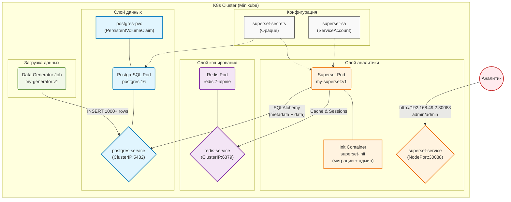

# Лабораторная работа 3.1. Развертывание приложения в Kubernetes

# Цель работы

Освоить процесс оркестрации контейнеров. Научиться разворачивать связки сервисов (аналитическое приложение + база данных/интерфейс) в кластере Kubernetes, управлять их масштабированием (Deployment) и сетевой доступностью (Service).

# Индивидуальное задание

| Вариант | Основной сервис (App) | Вспомогательный сервис (DB/Tool) | Задача |
|---------|----------------------|----------------------------------|--------|
| **12** | **Apache Superset** | **PostgreSQL** | Попытаться развернуть Superset (или облегченную версию) с подключением к БД. |

## Технический стек и окружение

**ОС:** Ubuntu 24.04 LTS

**Контейнеризация:** Docker 24.x

**Оркестрация:** Minikube (Driver: Docker), Kubernetes (kubectl)

**База данных:** PostgreSQL 16, Redis 7

**Язык программирования:** Python 3.10

**Аналитическая среда:** Apache Superset 6.0.0 

**Библиотеки:** psycopg2-binary, flask, sqlalchemy, redis, random, datetime, time

## 3. Архитектура решения



# Таблица пояснения компонентов архитектуры

| Блок | Компонент | Краткое пояснение |
|------|-----------|-------------------|
| **Configs** | Secret / ServiceAccount | Secret хранит пароли (PostgreSQL, Redis, Superset). ServiceAccount предоставляет права доступа для Superset. |
| **Database** | PostgreSQL / hostPath | База данных для хранения метаданных Superset и таблицы sales. hostPath обеспечивает сохранность данных в /tmp/postgres-data. |
| **Cache** | Redis | Кэш для ускорения запросов и хранения сессий пользователей. |
| **Analytics** | Superset | BI-платформа для визуализации данных. Использует InitContainer для миграций БД и создания администратора. |
| **Data** | Data Generator Job | Однократный процесс, наполняющий БД тестовыми данными (1000+ записей о продажах). |
| **User** | Аналитик | Внешний пользователь, получающий доступ к Superset через NodePort (порт 30088). |

# Исходные коды файлов

## Образ Apache Superset

### `app/Dockerfile`

Dockerfile - для сборки кастомного образа Superset. На основе официального образа apache/superset:6.0.0-dev копирует конфигурационный файл superset_config.py, устанавливает права доступа и указывает путь к нему через переменную окружения:

```
FROM apache/superset:6.0.0-dev
 
USER root
 
COPY superset_config.py /app/superset_config.py
RUN chown superset:superset /app/superset_config.py
 
ENV SUPERSET_CONFIG_PATH=/app/superset_config.py
 
USER superset
```

### `app/superset_config.py`

Конфигурационный файл Apache Superset. Определяет подключение к PostgreSQL через SQLAlchemy, настройки Redis для кэширования, секретный ключ, включение дополнительных функций:
```
import os
from cachelib.redis import RedisCache
 
SECRET_KEY = os.environ.get("SUPERSET_SECRET_KEY", "super-secret-key-CHANGE-THIS-9876543210abcdef")
 
# Подключение к PostgreSQL
SQLALCHEMY_DATABASE_URI = (
    f"postgresql+psycopg2://{os.environ.get('DB_USER', 'superset')}:"
    f"{os.environ.get('DB_PASS', 'superset123')}@"
    f"{os.environ.get('DB_HOST', 'postgres-service')}:"
    f"{os.environ.get('DB_PORT', '5432')}/"
    f"{os.environ.get('DB_NAME', 'superset')}"
)
 
# Redis 
REDIS_HOST = os.environ.get("REDIS_HOST", "redis-service")
REDIS_PORT = int(os.environ.get("REDIS_PORT", "6379"))
REDIS_DB = int(os.environ.get("REDIS_DB", "0"))
REDIS_CELERY_DB = int(os.environ.get("REDIS_CELERY_DB", "1"))
 
CACHE_CONFIG = {
    "CACHE_TYPE": "RedisCache",
    "CACHE_REDIS_HOST": REDIS_HOST,
    "CACHE_REDIS_PORT": REDIS_PORT,
    "CACHE_REDIS_DB": REDIS_DB,
}
 
CELERY_CONFIG = {
    "broker_url": f"redis://{REDIS_HOST}:{REDIS_PORT}/{REDIS_CELERY_DB}",
    "result_backend": f"redis://{REDIS_HOST}:{REDIS_PORT}/{REDIS_CELERY_DB}",
}
 
RESULTS_BACKEND = RedisCache(
    host=REDIS_HOST, port=REDIS_PORT, db=REDIS_DB, key_prefix="superset_results"
)
 
ENABLE_PROXY_FIX = True
FEATURE_FLAGS = {
    "DASHBOARD_NATIVE_FILTERS": True,
    "ALERT_REPORTS": True,
    "EMBEDDED_DASHBOARDS": True,
}
 
SILENCE_FAB_WARNINGS = True
```

### `generator/Dockerfile`

Dockerfile для сборки образа генератора данных. Устанавливает драйвер psycopg2-binary для работы с PostgreSQL и запускает скрипт generator.py:
```
FROM python:3.10-slim
WORKDIR /app
COPY generator.py .
RUN pip install --no-cache-dir psycopg2-binary
CMD ["python", "-u", "generator.py"]
```

### `generator/generator.py`

Скрипт генерации тестовых данных о продажах в магазине электроники:
```
import os
import psycopg2
import random
import time
from datetime import datetime, timedelta
 
# Функция для ожидания подключения к БД
def wait_for_db():
    max_retries = 30
    retry_interval = 2
    
    for i in range(max_retries):
        try:
            conn = psycopg2.connect(
                host=os.getenv("DB_HOST", "postgres-service"),
                port=os.getenv("DB_PORT", "5432"),
                dbname=os.getenv("DB_NAME", "superset"),
                user=os.getenv("DB_USER", "superset"),
                password=os.getenv("DB_PASS", "superset123")
            )
            conn.close()
            print("✅ База данных доступна")
            return True
        except psycopg2.OperationalError as e:
            print(f"⏳ Ожидание БД... ({i+1}/{30})")
            time.sleep(retry_interval)
    
    print("❌ Не удалось подключиться к БД")
    return False
 
# Ждем подключения к БД
if not wait_for_db():
    exit(1)
 
# Подключение к базе данных
conn = psycopg2.connect(
    host=os.getenv("DB_HOST", "postgres-service"),
    port=os.getenv("DB_PORT", "5432"),
    dbname=os.getenv("DB_NAME", "superset"),
    user=os.getenv("DB_USER", "superset"),
    password=os.getenv("DB_PASS", "superset123")
)
cur = conn.cursor()
 
# Удаляем старую таблицу, если есть
cur.execute("DROP TABLE IF EXISTS sales CASCADE")
 
# Создаем новую таблицу
cur.execute("""
CREATE TABLE sales (
    id SERIAL PRIMARY KEY,
    product VARCHAR(100),
    category VARCHAR(50),
    quantity INT,
    price NUMERIC(10,2),
    sale_date DATE,
    region VARCHAR(50),
    customer_type VARCHAR(50),
    payment_method VARCHAR(50)
)
""")
 
# Данные для генерации с обновленными ценами
products = {
    "iPhone 15 Pro": {"category": "Смартфоны", "price": 89999, "weight": 30},
    "Samsung Galaxy S24": {"category": "Смартфоны", "price": 69999, "weight": 30},
    "Планшет iPad Air": {"category": "Планшеты", "price": 69990, "weight": 20},
    "Планшет Samsung Tab": {"category": "Планшеты", "price": 49990, "weight": 15},
    "Ноутбук Dell XPS": {"category": "Электроника", "price": 120000, "weight": 8},
    "Монитор LG UltraWide": {"category": "Мониторы", "price": 45990, "weight": 6},
    "Sony WH-1000XM5": {"category": "Аудио", "price": 24990, "weight": 5},
    "Клавиатура Logitech MX": {"category": "Аксессуары", "price": 8000, "weight": 3},   # Исправлено
    "Мышь Razer": {"category": "Аксессуары", "price": 4800, "weight": 2},                 # Исправлено
    "Чехол для телефона": {"category": "Аксессуары", "price": 800, "weight": 1}          # Исправлено
}
 
# Города с весами для количества продаж
cities = {
    "Москва": 45,           # больше всего продаж (45%)
    "Санкт-Петербург": 30,  # поменьше (30%)
    "Екатеринбург": 12,     # средний показатель
    "Казань": 8,            # поменьше
    "Новосибирск": 5        # меньше всего (5%)
}
 
# Типы клиентов с весами для выручки
customer_types = {
    "VIP": 60,      # больше всего выручки (60%)
    "Постоянный": 30,  # поменьше (30%)
    "Новый": 10       # значительно меньше (10%)
}
 
payment_methods = ["Карта", "Наличные", "Онлайн"]
 
# Функция выбора с весами
def weighted_choice(weighted_dict):
    items = list(weighted_dict.keys())
    weights = list(weighted_dict.values())
    return random.choices(items, weights=weights)[0]
 
# Функция для расчета количества товара (чем дороже, тем меньше количество)
def get_quantity_by_price(price):
    if price >= 100000:
        return random.randint(1, 3)      # очень дорогие товары - мало
    elif price >= 50000:
        return random.randint(2, 8)      # дорогие товары - среднее количество
    elif price >= 20000:
        return random.randint(5, 15)     # средние товары
    else:
        return random.randint(10, 50)    # дешевые товары - много (увеличено для аксессуаров)
 
# Генерируем 1000 записей
print("🔄 Генерация данных с заданным распределением...")
total_records = 1000
 
for i in range(total_records):
    # Выбираем продукт с учетом веса (прибыльности)
    product_name = weighted_choice({k: v["weight"] for k, v in products.items()})
    product = products[product_name]
    category = product["category"]
    base_price = product["price"]
    
    # Добавляем вариативность цены ±10%
    price = round(base_price * random.uniform(0.95, 1.05), 2)
    
    # Количество зависит от цены (чем дороже, тем меньше)
    quantity = get_quantity_by_price(price)
    
    # Выбираем город с весами (Москва чаще всего)
    region = weighted_choice(cities)
    
    # Выбираем тип клиента с весами (VIP чаще для дорогих товаров)
    if price > 50000:
        # Дорогие товары чаще покупают VIP и постоянные
        cust_weights = {"VIP": 45, "Постоянный": 35, "Новый": 20}
    else:
        cust_weights = customer_types
    customer_type = weighted_choice(cust_weights)
    
    # Случайная дата за последние 2 года
    sale_date = (datetime.now() - timedelta(days=random.randint(0, 730))).date()
    
    cur.execute(
        """
        INSERT INTO sales 
        (product, category, quantity, price, sale_date, region, customer_type, payment_method)
        VALUES (%s, %s, %s, %s, %s, %s, %s, %s)
        """,
        (
            product_name,
            category,
            quantity,
            price,
            sale_date,
            region,
            customer_type,
            random.choice(payment_methods)
        )
    )
conn.commit()
 
cur.close()
conn.close()
print("\nГенерация данных завершена!")
```

### `k8s/secret.yaml`

Хранит учетные данные для подключения к PostgreSQL (пользователь, пароль, БД) и Redis (хост, порт), а также секретный ключ Superset:
```
apiVersion: v1
kind: Secret
metadata:
  name: superset-secrets
type: Opaque
stringData:
  POSTGRES_USER: superset
  POSTGRES_PASSWORD: superset123
  POSTGRES_DB: superset
  DB_USER: superset
  DB_PASS: superset123
  DB_HOST: postgres-service
  DB_PORT: "5432"
  DB_NAME: superset
  SUPERSET_SECRET_KEY: "super-secret-key-CHANGE-THIS-9876543210abcdef"
  REDIS_HOST: redis-service
  REDIS_PORT: "6379"
  REDIS_DB: "0"
  REDIS_CELERY_DB: "1"
```

### `k8s/serviceaccount.yaml`

ServiceAccount для Superset, используемый для назначения прав доступа внутри кластера:
```
apiVersion: v1
kind: ServiceAccount
metadata:
  name: superset-sa
```

### `k8s/postgres-deployment.yaml`

Развертывание PostgreSQL. Содержит init-контейнер для исправления прав доступа, переменные окружения из секрета, PVC для хранения данных:
```
apiVersion: apps/v1
kind: Deployment
metadata:
  name: postgres
spec:
  replicas: 1
  selector:
    matchLabels:
      app: postgres
  template:
    metadata:
      labels:
        app: postgres
    spec:
      serviceAccountName: superset-sa
      
      initContainers:
      - name: fix-permissions
        image: busybox
        command: ['sh', '-c', 'chown -R 999:999 /var/lib/postgresql/data']
        volumeMounts:
        - name: postgres-storage
          mountPath: /var/lib/postgresql/data
 
      containers:
      - name: postgres
        image: postgres:16
        imagePullPolicy: IfNotPresent
        
        env:
        - name: POSTGRES_USER
          valueFrom:
            secretKeyRef:
              name: superset-secrets
              key: POSTGRES_USER
        - name: POSTGRES_PASSWORD
          valueFrom:
            secretKeyRef:
              name: superset-secrets
              key: POSTGRES_PASSWORD
        - name: POSTGRES_DB
          valueFrom:
            secretKeyRef:
              name: superset-secrets
              key: POSTGRES_DB
 
        ports:
        - containerPort: 5432
          name: postgres
 
        volumeMounts:
        - mountPath: /var/lib/postgresql/data
          name: postgres-storage
 
      volumes:
      - name: postgres-storage
        persistentVolumeClaim:
          claimName: postgres-pvc
```

### `k8s/postgres-service.yaml`

Сервис для доступа к PostgreSQL внутри кластера на порту 5432:
```
apiVersion: v1
kind: Service
metadata:
  name: postgres-service
spec:
  selector:
    app: postgres
  ports:
  - port: 5432
    targetPort: 5432
```

### `k8s/postgres-deployment-hostpath.yaml`

Развертывание PostgreSQL с использованием hostPath вместо PVC. Создает один под с PostgreSQL 16, монтирует директорию /tmp/postgres-data на хосте для хранения данных, переменные окружения (пользователь, пароль, БД) подставляются из секрета:
```
apiVersion: apps/v1
kind: Deployment
metadata:
  name: postgres
spec:
  replicas: 1
  selector:
    matchLabels:
      app: postgres
  template:
    metadata:
      labels:
        app: postgres
    spec:
      serviceAccountName: superset-sa
      
      containers:
      - name: postgres
        image: postgres:16
        imagePullPolicy: IfNotPresent
        
        env:
        - name: POSTGRES_USER
          valueFrom:
            secretKeyRef:
              name: superset-secrets
              key: POSTGRES_USER
        - name: POSTGRES_PASSWORD
          valueFrom:
            secretKeyRef:
              name: superset-secrets
              key: POSTGRES_PASSWORD
        - name: POSTGRES_DB
          valueFrom:
            secretKeyRef:
              name: superset-secrets
              key: POSTGRES_DB
 
        ports:
        - containerPort: 5432
          name: postgres
 
        volumeMounts:
        - mountPath: /var/lib/postgresql/data
          name: postgres-storage
 
      volumes:
      - name: postgres-storage
        hostPath:
          path: /tmp/postgres-data
          type: DirectoryOrCreate
```
