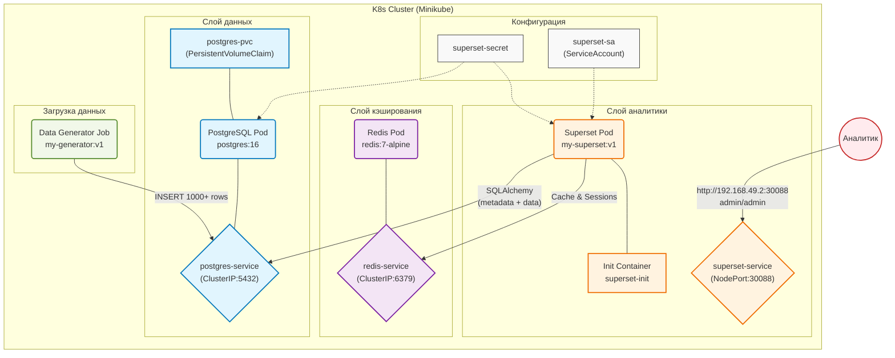
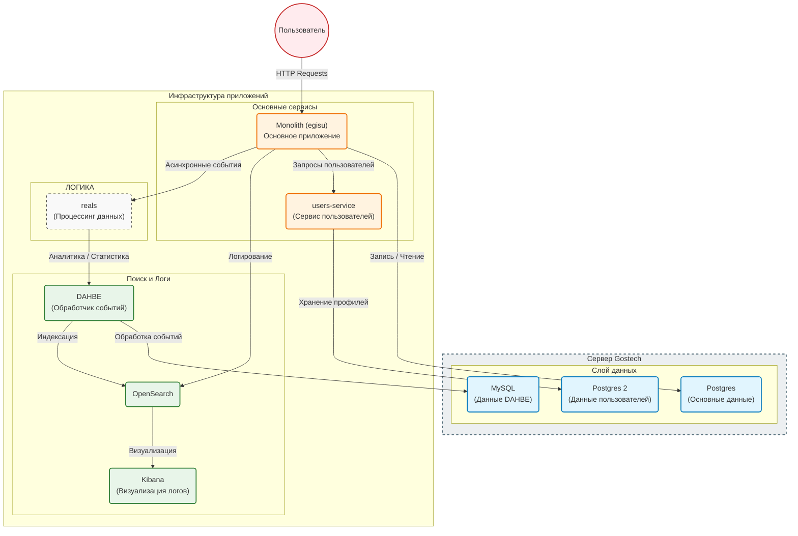

# Лабораторная работа 3.1. Развертывание приложения в Kubernetes

# Цель работы

Освоить процесс оркестрации контейнеров. Научиться разворачивать связки сервисов (аналитическое приложение + база данных/интерфейс) в кластере Kubernetes, управлять их масштабированием (Deployment) и сетевой доступностью (Service).

# Индивидуальное задание

| Вариант | Основной сервис (App) | Вспомогательный сервис (DB/Tool) | Задача |
|---------|----------------------|----------------------------------|--------|
| **12** | **Apache Superset** | **PostgreSQL** | Попытаться развернуть Superset (или облегченную версию) с подключением к БД. |

## Технический стек и окружение

**ОС:** Ubuntu 24.04 LTS

**Контейнеризация:** Docker 24.x

**Оркестрация:** Minikube (Driver: Docker), Kubernetes (kubectl)

**База данных:** PostgreSQL 16, Redis 7

**Язык программирования:** Python 3.10

**Аналитическая среда:** Apache Superset 6.0.0 

**Библиотеки:** psycopg2-binary, flask, sqlalchemy, redis, random, datetime, time

## 3. Архитектура решения






# Таблица пояснения компонентов архитектуры

| Блок | Компонент | Краткое пояснение |
|------|-----------|-------------------|
| **Configs** | Secret / ServiceAccount | Secret хранит пароли (PostgreSQL, Redis, Superset). ServiceAccount предоставляет права доступа для Superset. |
| **Database** | PostgreSQL / PVC | База данных для хранения метаданных Superset и таблицы sales. |
| **Cache** | Redis | Кэш для ускорения запросов и хранения сессий пользователей. |
| **Analytics** | Superset | BI-платформа для визуализации данных. |
| **Data** | Data Generator Job | Однократный процесс, наполняющий БД тестовыми данными (1000 записей о продажах). |
| **User** | Аналитик | Внешний пользователь, получающий доступ к Superset. |

# Исходные коды файлов

## Образ Apache Superset

### `app/Dockerfile`

Dockerfile - для сборки кастомного образа Superset. На основе официального образа apache/superset:6.0.0-dev копирует конфигурационный файл superset_config.py, устанавливает права доступа и указывает путь к нему через переменную окружения:

```
FROM apache/superset:6.0.0-dev
 
USER root
 
COPY superset_config.py /app/superset_config.py
RUN chown superset:superset /app/superset_config.py
 
ENV SUPERSET_CONFIG_PATH=/app/superset_config.py
 
USER superset
```

### `app/superset_config.py`

Конфигурационный файл Apache Superset. Определяет подключение к PostgreSQL через SQLAlchemy, настройки Redis для кэширования, секретный ключ, включение дополнительных функций:
```
import os
from cachelib.redis import RedisCache
 
SECRET_KEY = os.environ.get("SUPERSET_SECRET_KEY", "super-secret-key-CHANGE-THIS-9876543210abcdef")
 
# Подключение к PostgreSQL
SQLALCHEMY_DATABASE_URI = (
    f"postgresql+psycopg2://{os.environ.get('DB_USER', 'superset')}:"
    f"{os.environ.get('DB_PASS', 'superset123')}@"
    f"{os.environ.get('DB_HOST', 'postgres-service')}:"
    f"{os.environ.get('DB_PORT', '5432')}/"
    f"{os.environ.get('DB_NAME', 'superset')}"
)
 
# Redis 
REDIS_HOST = os.environ.get("REDIS_HOST", "redis-service")
REDIS_PORT = int(os.environ.get("REDIS_PORT", "6379"))
REDIS_DB = int(os.environ.get("REDIS_DB", "0"))
REDIS_CELERY_DB = int(os.environ.get("REDIS_CELERY_DB", "1"))
 
CACHE_CONFIG = {
    "CACHE_TYPE": "RedisCache",
    "CACHE_REDIS_HOST": REDIS_HOST,
    "CACHE_REDIS_PORT": REDIS_PORT,
    "CACHE_REDIS_DB": REDIS_DB,
}
 
CELERY_CONFIG = {
    "broker_url": f"redis://{REDIS_HOST}:{REDIS_PORT}/{REDIS_CELERY_DB}",
    "result_backend": f"redis://{REDIS_HOST}:{REDIS_PORT}/{REDIS_CELERY_DB}",
}
 
RESULTS_BACKEND = RedisCache(
    host=REDIS_HOST, port=REDIS_PORT, db=REDIS_DB, key_prefix="superset_results"
)
 
ENABLE_PROXY_FIX = True
FEATURE_FLAGS = {
    "DASHBOARD_NATIVE_FILTERS": True,
    "ALERT_REPORTS": True,
    "EMBEDDED_DASHBOARDS": True,
}
 
SILENCE_FAB_WARNINGS = True
```

### `generator/Dockerfile`

Dockerfile для сборки образа генератора данных. Устанавливает драйвер psycopg2-binary для работы с PostgreSQL и запускает скрипт generator.py:
```
FROM python:3.10-slim
WORKDIR /app
COPY generator.py .
RUN pip install --no-cache-dir psycopg2-binary
CMD ["python", "-u", "generator.py"]
```

### `generator/generator.py`

Скрипт генерации тестовых данных о продажах в магазине электроники:
```
import os
import psycopg2
import random
import time
from datetime import datetime, timedelta
 
# Функция для ожидания подключения к БД
def wait_for_db():
    max_retries = 60
    retry_interval = 5
    
    for i in range(max_retries):
        try:
            conn = psycopg2.connect(
                host=os.getenv("DB_HOST", "postgres-service"),
                port=os.getenv("DB_PORT", "5432"),
                dbname=os.getenv("DB_NAME", "superset"),
                user=os.getenv("DB_USER", "superset"),
                password=os.getenv("DB_PASS", "superset123")
            )
            conn.close()
            print("✅ База данных доступна")
            return True
        except psycopg2.OperationalError as e:
            print(f"⏳ Ожидание БД... ({i+1}/{max_retries})")
            time.sleep(retry_interval)
    
    print("❌ Не удалось подключиться к БД")
    return False
 
# Ждем подключения к БД
if not wait_for_db():
    exit(1)
 
# Подключение к базе данных
conn = psycopg2.connect(
    host=os.getenv("DB_HOST", "postgres-service"),
    port=os.getenv("DB_PORT", "5432"),
    dbname=os.getenv("DB_NAME", "superset"),
    user=os.getenv("DB_USER", "superset"),
    password=os.getenv("DB_PASS", "superset123")
)
cur = conn.cursor()
 
# Удаляем старую таблицу, если есть
cur.execute("DROP TABLE IF EXISTS sales CASCADE")
 
# Создаем новую таблицу
cur.execute("""
CREATE TABLE sales (
    id SERIAL PRIMARY KEY,
    product VARCHAR(100),
    category VARCHAR(50),
    quantity INT,
    price NUMERIC(10,2),
    sale_date DATE,
    region VARCHAR(50),
    customer_type VARCHAR(50),
    payment_method VARCHAR(50)
)
""")
 
# Данные для генерации
products = {
    "iPhone 15 Pro": {"category": "Смартфоны", "price": 89999, "weight": 30},
    "Samsung Galaxy S24": {"category": "Смартфоны", "price": 69999, "weight": 30},
    "Планшет iPad Air": {"category": "Планшеты", "price": 69990, "weight": 20},
    "Планшет Samsung Tab": {"category": "Планшеты", "price": 49990, "weight": 15},
    "Ноутбук Dell XPS": {"category": "Электроника", "price": 120000, "weight": 8},
    "Монитор LG UltraWide": {"category": "Мониторы", "price": 45990, "weight": 6},
    "Sony WH-1000XM5": {"category": "Аудио", "price": 24990, "weight": 5},
    "Клавиатура Logitech MX": {"category": "Аксессуары", "price": 8000, "weight": 3},
    "Мышь Razer": {"category": "Аксессуары", "price": 4800, "weight": 2},
    "Чехол для телефона": {"category": "Аксессуары", "price": 800, "weight": 1}
}
 
# Города с весами
cities = {
    "Москва": 45,
    "Санкт-Петербург": 30,
    "Екатеринбург": 12,
    "Казань": 8,
    "Новосибирск": 5
}
 
# Типы клиентов
customer_types = {
    "VIP": 60,
    "Постоянный": 30,
    "Новый": 10
}
 
payment_methods = ["Карта", "Наличные", "Онлайн"]
 
def weighted_choice(weighted_dict):
    items = list(weighted_dict.keys())
    weights = list(weighted_dict.values())
    return random.choices(items, weights=weights)[0]
 
def get_quantity_by_price(price):
    if price >= 100000:
        return random.randint(1, 3)
    elif price >= 50000:
        return random.randint(2, 8)
    elif price >= 20000:
        return random.randint(5, 15)
    else:
        return random.randint(10, 50)
 
print("🔄 Генерация данных...")
total_records = 1000
 
for i in range(total_records):
    product_name = weighted_choice({k: v["weight"] for k, v in products.items()})
    product = products[product_name]
    category = product["category"]
    base_price = product["price"]
    price = round(base_price * random.uniform(0.95, 1.05), 2)
    quantity = get_quantity_by_price(price)
    region = weighted_choice(cities)
    
    if price > 50000:
        cust_weights = {"VIP": 45, "Постоянный": 35, "Новый": 20}
    else:
        cust_weights = customer_types
    customer_type = weighted_choice(cust_weights)
    
    sale_date = (datetime.now() - timedelta(days=random.randint(0, 730))).date()
    
    cur.execute(
        """
        INSERT INTO sales 
        (product, category, quantity, price, sale_date, region, customer_type, payment_method)
        VALUES (%s, %s, %s, %s, %s, %s, %s, %s)
        """,
        (
            product_name,
            category,
            quantity,
            price,
            sale_date,
            region,
            customer_type,
            random.choice(payment_methods)
        )
    )
 
conn.commit()
 
cur.execute("SELECT COUNT(*) FROM sales")
count = cur.fetchone()[0]
print(f"✅ Создано {count} записей")
 
cur.close()
conn.close()
print("🎉 Генерация данных завершена!")
```

### `k8s/secret.yaml`

Хранит учетные данные для подключения к PostgreSQL (пользователь, пароль, БД) и Redis (хост, порт), а также секретный ключ Superset:
```
apiVersion: v1
kind: Secret
metadata:
  name: superset-secrets
type: Opaque
stringData:
  POSTGRES_USER: superset
  POSTGRES_PASSWORD: superset123
  POSTGRES_DB: superset
  DB_USER: superset
  DB_PASS: superset123
  DB_HOST: postgres-service
  DB_PORT: "5432"
  DB_NAME: superset
  SUPERSET_SECRET_KEY: "super-secret-key-CHANGE-THIS-9876543210abcdef"
  REDIS_HOST: redis-service
  REDIS_PORT: "6379"
  REDIS_DB: "0"
  REDIS_CELERY_DB: "1"
```

### `k8s/serviceaccount.yaml`

ServiceAccount для Superset, используемый для назначения прав доступа внутри кластера:
```
apiVersion: v1
kind: ServiceAccount
metadata:
  name: superset-sa
```

### `k8s/pvc.yaml`

PersistentVolumeClaim (PVC) для PostgreSQL:
```
apiVersion: v1
kind: PersistentVolumeClaim
metadata:
  name: postgres-pvc
spec:
  accessModes:
    - ReadWriteOnce
  resources:
    requests:
      storage: 3Gi
```

### `k8s/postgres-deployment.yaml`

Развертывание PostgreSQL. Содержит init-контейнер для исправления прав доступа, переменные окружения из секрета, PVC для хранения данных:
```
apiVersion: apps/v1
kind: Deployment
metadata:
  name: postgres
spec:
  replicas: 1
  selector:
    matchLabels:
      app: postgres
  template:
    metadata:
      labels:
        app: postgres
    spec:
      serviceAccountName: superset-sa
      
      initContainers:
      - name: init-chown
        image: busybox
        command: ['sh', '-c', 'chown -R 999:999 /var/lib/postgresql/data']
        volumeMounts:
        - name: postgres-storage
          mountPath: /var/lib/postgresql/data
 
      containers:
      - name: postgres
        image: postgres:16
        imagePullPolicy: IfNotPresent
        
        env:
        - name: POSTGRES_USER
          valueFrom:
            secretKeyRef:
              name: superset-secrets
              key: POSTGRES_USER
        - name: POSTGRES_PASSWORD
          valueFrom:
            secretKeyRef:
              name: superset-secrets
              key: POSTGRES_PASSWORD
        - name: POSTGRES_DB
          valueFrom:
            secretKeyRef:
              name: superset-secrets
              key: POSTGRES_DB
 
        ports:
        - containerPort: 5432
          name: postgres
 
        volumeMounts:
        - mountPath: /var/lib/postgresql/data
          name: postgres-storage
 
      volumes:
      - name: postgres-storage
        persistentVolumeClaim:
          claimName: postgres-pvc
```

### `k8s/postgres-service.yaml`

Сервис для доступа к PostgreSQL внутри кластера на порту 5432:
```
apiVersion: v1
kind: Service
metadata:
  name: postgres-service
spec:
  selector:
    app: postgres
  ports:
  - port: 5432
    targetPort: 5432
```

### `k8s/superset-deployment.yaml`

Развертывание Apache Superset. Содержит init-контейнер для инициализации БД и основной контейнер с портом 8088:
```
apiVersion: apps/v1
kind: Deployment
metadata:
  name: superset
spec:
  replicas: 1
  selector:
    matchLabels:
      app: superset
  template:
    metadata:
      labels:
        app: superset
    spec:
      serviceAccountName: superset-sa
 
      initContainers:
      - name: superset-init
        image: my-superset:v1 
        imagePullPolicy: Never
        envFrom:
        - secretRef:
            name: superset-secrets
        command: ["/bin/sh", "-c"]
        args:
        - |
          echo "=== Starting Superset 6.0.0 initialization ===" &&
          superset db upgrade &&
          echo "=== DB upgrade completed ===" &&
          superset fab create-admin \
            --username admin \
            --firstname Admin \
            --lastname User \
            --email admin@example.com \
            --password admin || true &&
          echo "=== Running superset init ===" &&
          superset init &&
          echo "=== Initialization completed successfully ==="
 
      containers:
      - name: superset
        image: my-superset:v1 
        imagePullPolicy: Never
        envFrom:
        - secretRef:
            name: superset-secrets
        ports:
        - containerPort: 8088
          name: http
```

### `k8s/superset-service.yaml`

Сервис для доступа к Superset, открывается на порту 30088:
```
apiVersion: v1
kind: Service
metadata:
  name: superset-service
spec:
  type: NodePort
  selector:
    app: superset
  ports:
  - port: 8088
    targetPort: 8088
    nodePort: 30088
```

### `k8s/redis-deployment.yaml`

Развертывание Redis для кэширования. Запускает один под с Redis 7-alpine на порту 6379:
```
apiVersion: apps/v1
kind: Deployment
metadata:
  name: redis
spec:
  replicas: 1
  selector:
    matchLabels:
      app: redis
  template:
    metadata:
      labels:
        app: redis
    spec:
      containers:
      - name: redis
        image: redis:7-alpine
        ports:
        - containerPort: 6379
```

### `k8s/redis-service.yaml`

Сервис для доступа к Redis внутри кластера на порту 6379:
```
apiVersion: v1
kind: Service
metadata:
  name: redis-service
spec:
  selector:
    app: redis
  ports:
  - port: 6379
    targetPort: 6379
```

### `k8s/generator-job.yaml`

Job для генерации тестовых данных. Запускает контейнер my-generator:v1, который подключается к PostgreSQL и заполняет таблицу `sales` данными:
```
apiVersion: batch/v1
kind: Job
metadata:
  name: data-generator
spec:
  template:
    spec:
      restartPolicy: Never
      containers:
      - name: generator
        image: my-generator:v1 
        imagePullPolicy: Never
        envFrom:
        - secretRef:
            name: superset-secrets
```

# Ход выполнения

Запускаем Kubernets:


Входим в окружение minikube и собираем образы.

Образ superset:


Образ generator:


Применим манифесты Kubernets:


Проверим доступность приложения:


Superset успешно запустился, переходим в браузер:


Заходим под admin admin:


Подключаемся к базе данных:


Подключение произошло успешно:


Добавляем наш датасет:


Далее создаем графики и размещаем их на дашборде:


##### Выводы по дашборду

###### Сезонность
В данных отсутствует ярко выраженная сезонность. Это характерно для магазина электроники, где спрос на товары распределен равномерно в течение года без значительных пиков в определенные периоды.

###### Региональное распределение
- **Москва** — данный филиал приносит наибольшую прибыль за счет более высокой плотности населения.
- **Новосибирск** — наименьшие показатели выручки, это может быть связано с меньшей численностью населения или более низкой покупательской активностью. Возможно, данный филиал открылся недавно.

###### Категории товаров
- **Смартфоны** — лидируют по объему продаж, так как часто меняются их модели. Эта категория товаров очень востребована.
- **Аксессуары** — занимают второе место, так как являются сопутствующими товарами, часто сменяемыми (например, чехлы для телефона) и недорогими.
- **Планшеты** — также показывают высокие показатели по объему продаж, пользуются стабильным спросом.
- **Электроника** — наименьшие продажи, ввиду более высокой стоимости и более длительного срока службы.

###### Типы клиентов
- **VIP-клиенты** — приносят наибольшую прибыль, вероятно в компании хорошо продуманные программы лояльности и индивидуальный подход.
- **Постоянные клиенты** — занимают промежуточное положение, приносят значительный вклад в выручку.
- **Новые клиенты** — показывают наименьшую прибыль, скорее всего компании стоит пересмотреть свои маркетинговые стратегии, чтобы привлекать больше новых клиентов.

Также добавим фильтры:


Попробуем их применить:


Теперь вернемся в терминал и проверим корректность работы всех подов:


Посмотрим сервисы:


И также проверим, что база данных действительно создалась и в нее были загружены все записи:


Видим, что в таблице 1000 записей, как и должно быть

Теперь посмотрим первые 5 строк таблицы:


# Вывод

В ходе выполнения лабораторной работы был полностью освоен процесс оркестрации контейнеров в Kubernetes. Успешно развёрнута связка из двух сервисов — Apache Superset и PostgreSQL. Отработаны механизмы управления масштабированием приложения с помощью Deployment, настроена сетевая доступность между компонентами с использованием различных типов Service. Все сервисы успешно взаимодействуют друг с другом, кластер функционирует стабильно. Поставленная цель достигнута.
