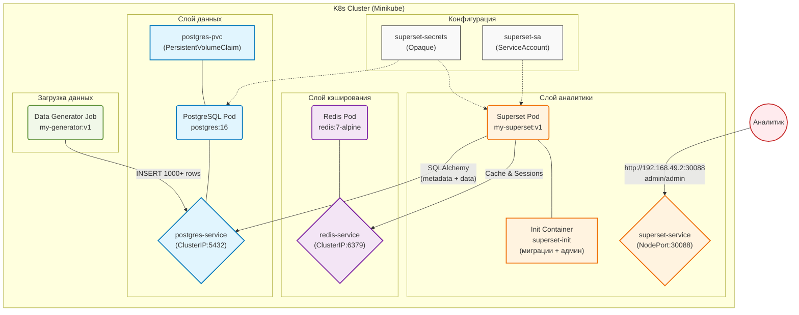

# Лабораторная работа 3.1. Развертывание приложения в Kubernetes

# Цель работы

Освоить процесс оркестрации контейнеров. Научиться разворачивать связки сервисов (аналитическое приложение + база данных/интерфейс) в кластере Kubernetes, управлять их масштабированием (Deployment) и сетевой доступностью (Service).

# Индивидуальное задание

| Вариант | Основной сервис (App) | Вспомогательный сервис (DB/Tool) | Задача |
|---------|----------------------|----------------------------------|--------|
| **12** | **Apache Superset** | **PostgreSQL** | Попытаться развернуть Superset (или облегченную версию) с подключением к БД. |

## Технический стек и окружение

**ОС:** Ubuntu 24.04 LTS

**Контейнеризация:** Docker 24.x

**Оркестрация:** Minikube (Driver: Docker), Kubernetes (kubectl)

**База данных:** PostgreSQL 16, Redis 7

**Язык программирования:** Python 3.10

**Аналитическая среда:** Apache Superset 6.0.0 

**Библиотеки:** psycopg2-binary, flask, sqlalchemy, redis, random, datetime, time

## 3. Архитектура решения



# Таблица пояснения компонентов архитектуры

| Блок | Компонент | Краткое пояснение |
|------|-----------|-------------------|
| **Configs** | Secret / ServiceAccount | Secret хранит пароли (PostgreSQL, Redis, Superset). ServiceAccount предоставляет права доступа для Superset. |
| **Database** | PostgreSQL / hostPath | База данных для хранения метаданных Superset и таблицы sales. hostPath обеспечивает сохранность данных в /tmp/postgres-data. |
| **Cache** | Redis | Кэш для ускорения запросов и хранения сессий пользователей. |
| **Analytics** | Superset | BI-платформа для визуализации данных. Использует InitContainer для миграций БД и создания администратора. |
| **Data** | Data Generator Job | Однократный процесс, наполняющий БД тестовыми данными (1000+ записей о продажах). |
| **User** | Аналитик | Внешний пользователь, получающий доступ к Superset через NodePort (порт 30088). |

# Исходные коды файлов

## Образ Apache Superset

### `app/Dockerfile`

Dockerfile - для сборки кастомного образа Superset. На основе официального образа apache/superset:6.0.0-dev копирует конфигурационный файл superset_config.py, устанавливает права доступа и указывает путь к нему через переменную окружения:

```
FROM apache/superset:6.0.0-dev
 
USER root
 
COPY superset_config.py /app/superset_config.py
RUN chown superset:superset /app/superset_config.py
 
ENV SUPERSET_CONFIG_PATH=/app/superset_config.py
 
USER superset
```

### `app/superset_config.py`

Конфигурационный файл Apache Superset. Определяет подключение к PostgreSQL через SQLAlchemy, настройки Redis для кэширования, секретный ключ, включение дополнительных функций:
```
import os
from cachelib.redis import RedisCache
 
SECRET_KEY = os.environ.get("SUPERSET_SECRET_KEY", "super-secret-key-CHANGE-THIS-9876543210abcdef")
 
# Подключение к PostgreSQL
SQLALCHEMY_DATABASE_URI = (
    f"postgresql+psycopg2://{os.environ.get('DB_USER', 'superset')}:"
    f"{os.environ.get('DB_PASS', 'superset123')}@"
    f"{os.environ.get('DB_HOST', 'postgres-service')}:"
    f"{os.environ.get('DB_PORT', '5432')}/"
    f"{os.environ.get('DB_NAME', 'superset')}"
)
 
# Redis 
REDIS_HOST = os.environ.get("REDIS_HOST", "redis-service")
REDIS_PORT = int(os.environ.get("REDIS_PORT", "6379"))
REDIS_DB = int(os.environ.get("REDIS_DB", "0"))
REDIS_CELERY_DB = int(os.environ.get("REDIS_CELERY_DB", "1"))
 
CACHE_CONFIG = {
    "CACHE_TYPE": "RedisCache",
    "CACHE_REDIS_HOST": REDIS_HOST,
    "CACHE_REDIS_PORT": REDIS_PORT,
    "CACHE_REDIS_DB": REDIS_DB,
}
 
CELERY_CONFIG = {
    "broker_url": f"redis://{REDIS_HOST}:{REDIS_PORT}/{REDIS_CELERY_DB}",
    "result_backend": f"redis://{REDIS_HOST}:{REDIS_PORT}/{REDIS_CELERY_DB}",
}
 
RESULTS_BACKEND = RedisCache(
    host=REDIS_HOST, port=REDIS_PORT, db=REDIS_DB, key_prefix="superset_results"
)
 
ENABLE_PROXY_FIX = True
FEATURE_FLAGS = {
    "DASHBOARD_NATIVE_FILTERS": True,
    "ALERT_REPORTS": True,
    "EMBEDDED_DASHBOARDS": True,
}
 
SILENCE_FAB_WARNINGS = True
```
