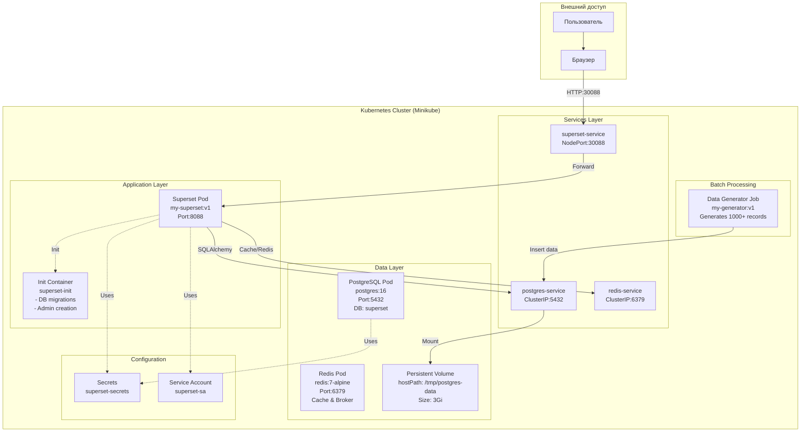

# Лабораторная работа 3.1. Развертывание приложения в Kubernetes

# Цель работы

Освоить процесс оркестрации контейнеров. Научиться разворачивать связки сервисов (аналитическое приложение + база данных/интерфейс) в кластере Kubernetes, управлять их масштабированием (Deployment) и сетевой доступностью (Service).

# Индивидуальное задание

| Вариант | Основной сервис (App) | Вспомогательный сервис (DB/Tool) | Задача |
|---------|----------------------|----------------------------------|--------|
| **12** | **Apache Superset** | **PostgreSQL** | Попытаться развернуть Superset (или облегченную версию) с подключением к БД. |

## Технический стек и окружение

**ОС:** Ubuntu 24.04 LTS

**Контейнеризация:** Docker 24.x

**Оркестрация:** Minikube (Driver: Docker), Kubernetes (kubectl)

**База данных:** PostgreSQL 16, Redis 7

**Язык программирования:** Python 3.10

**Аналитическая среда:** Apache Superset 6.0.0 

**Библиотеки:** psycopg2-binary, flask, sqlalchemy, redis, random, datetime, time

# Архитектура решения

# Архитектура сервиса аналитики данных

## Диаграмма архитектуры

