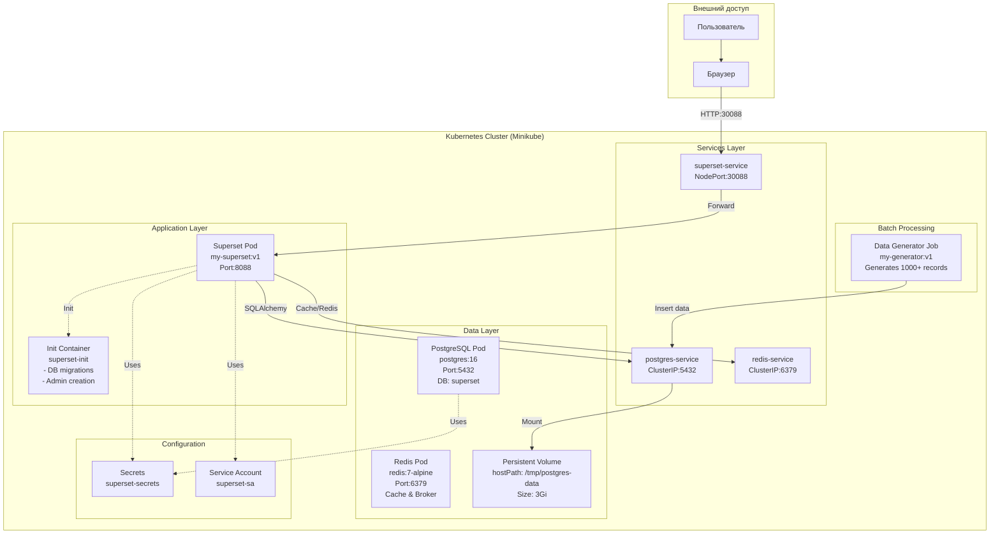
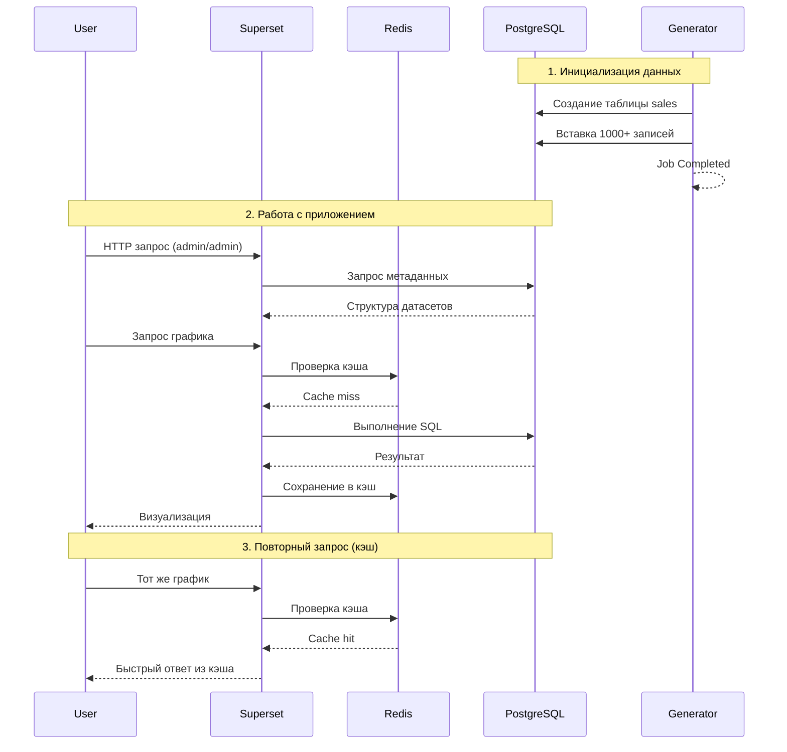
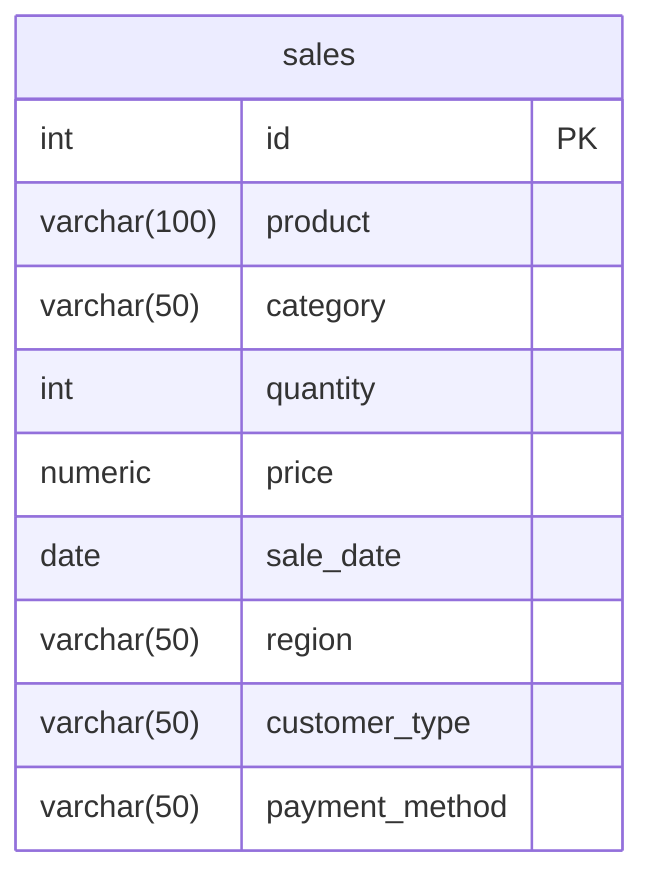
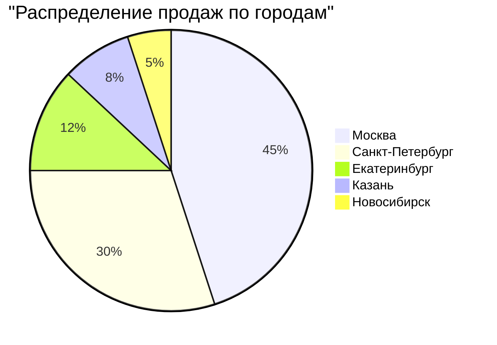
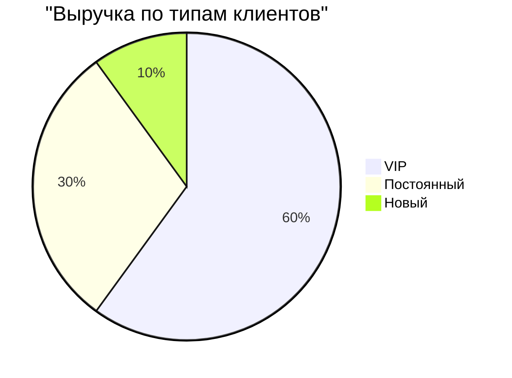
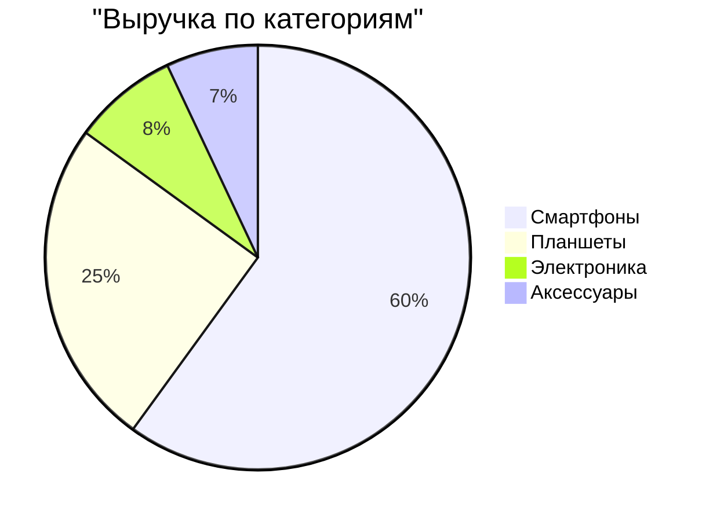
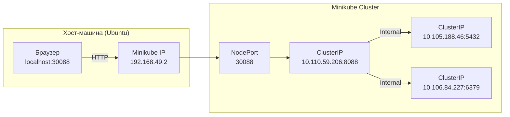
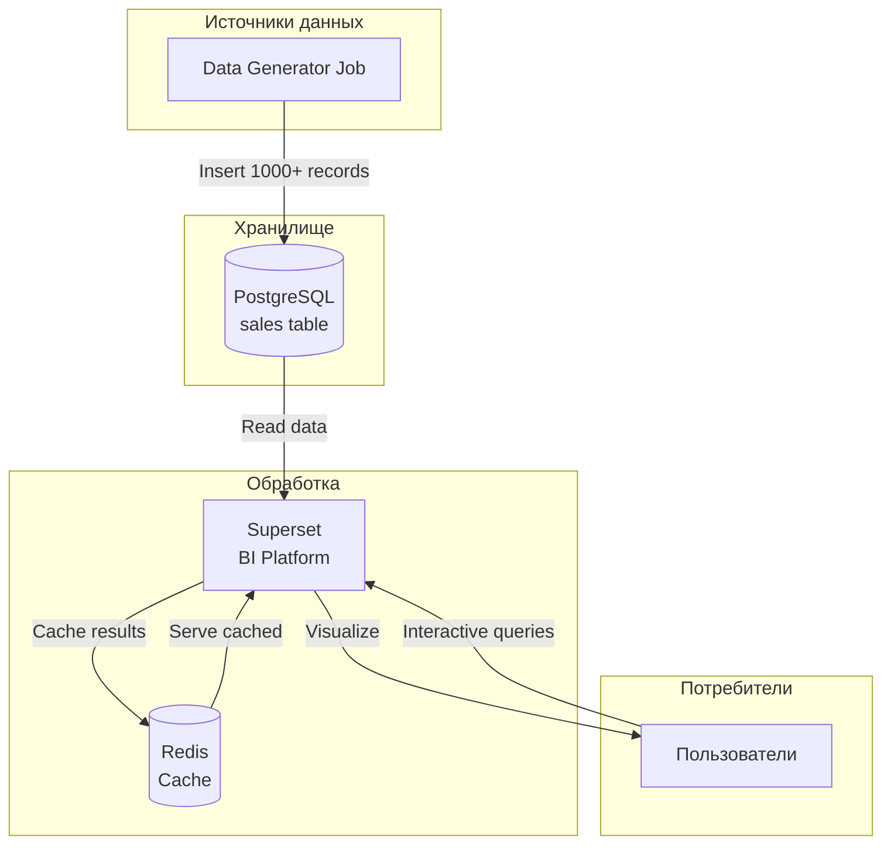

# Лабораторная работа 3.1. Развертывание приложения в Kubernetes

# Цель работы

Освоить процесс оркестрации контейнеров. Научиться разворачивать связки сервисов (аналитическое приложение + база данных/интерфейс) в кластере Kubernetes, управлять их масштабированием (Deployment) и сетевой доступностью (Service).

# Индивидуальное задание

| Вариант | Основной сервис (App) | Вспомогательный сервис (DB/Tool) | Задача |
|---------|----------------------|----------------------------------|--------|
| **12** | **Apache Superset** | **PostgreSQL** | Попытаться развернуть Superset (или облегченную версию) с подключением к БД. |

## Технический стек и окружение

**ОС:** Ubuntu 24.04 LTS

**Контейнеризация:** Docker 24.x

**Оркестрация:** Minikube (Driver: Docker), Kubernetes (kubectl)

**База данных:** PostgreSQL 16, Redis 7

**Язык программирования:** Python 3.10

**Аналитическая среда:** Apache Superset 6.0.0 

**Библиотеки:** psycopg2-binary, flask, sqlalchemy, redis, random, datetime, time

# Архитектура решения

# Архитектура сервиса аналитики данных

## Диаграмма архитектуры

## Схема взаимодействия компонентов

## Схема таблицы данных

## Распределение данных

## Сетевая архитектура

## Компоненты системы

### Основные компоненты

| Компонент | Технология | Версия | Назначение |
|-----------|------------|--------|------------|
| **Superset** | Apache Superset | 6.0.0 | BI-платформа, визуализация данных |
| **PostgreSQL** | PostgreSQL | 16 | Хранение данных и метаданных |
| **Redis** | Redis | 7-alpine | Кэширование, сессии, брокер |
| **Data Generator** | Python | 3.12 | Генерация тестовых данных |

### Сетевые сервисы

| Сервис | Тип | Порт | Доступ |
|--------|-----|------|--------|
| superset-service | NodePort | 8088:30088 | Внешний (http://192.168.49.2:30088) |
| postgres-service | ClusterIP | 5432 | Внутри кластера |
| redis-service | ClusterIP | 6379 | Внутри кластера |

### Хранилища

| Название | Тип | Размер | Монтирование |
|----------|-----|--------|--------------|
| postgres-pvc | PersistentVolumeClaim | 3Gi | /var/lib/postgresql/data |
| postgres-storage | hostPath | 3Gi | /tmp/postgres-data |

## Потоки данных

## Технический стек

| Категория | Технологии |
|-----------|------------|
| **ОС** | Ubuntu 24.04 LTS |
| **Контейнеризация** | Docker 24.x |
| **Оркестрация** | Minikube, Kubernetes (kubectl) |
| **База данных** | PostgreSQL 16, Redis 7 |
| **Язык программирования** | Python 3.10 (Superset), Python 3.12 (Generator) |
| **Аналитическая среда** | Apache Superset 6.0.0 |
| **Библиотеки** | psycopg2-binary, flask, sqlalchemy, redis |

