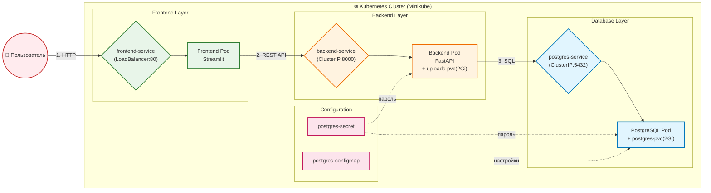

# Лабораторная работа 4.1. Создание и развертывание полнофункционального приложения

# Цель работы

Применить полученные знания по созданию и развертыванию трехзвенного приложения (Frontend + Backend + Database) в кластере Kubernetes. Научиться организовывать взаимодействие между микросервисами.

# Индивидуальное задание

| Вариант | Название системы | Бизнес-задача | Данные (Пример) |
|---------|------------------|---------------|------------------|
| 12 | Document Archive | Реестр документов | Название файла, тип, дата создания, ответственный |

# Технический стек и окружение

| Компонент | Технология | Версия |
|-----------|------------|--------|
| **Операционная система** | Ubuntu | 22.04 LTS |
| **Контейнеризация** | Docker | |
| **Оркестрация** | Minikube (Driver: Docker), Kubernetes | |
| **База данных** | PostgreSQL | 15-alpine |
| **Язык программирования** | Python | 3.12-slim |
| **Backend** | FastAPI, Uvicorn | |
| **Frontend** | Streamlit | 1.42.0 |
| **Библиотеки** | SQLAlchemy, psycopg2-binary, Pydantic, requests, pandas, plotly | |
| **Постоянное хранилище** | PVC (PersistentVolumeClaim) | 2Gi |

# Архитектура решения



# Таблица пояснения компонентов архитектуры

| Блок | Компонент | Краткое пояснение |
|------|-----------|-------------------|
| **Configs** | Secret / ConfigMap / ServiceAccount | Secret хранит пароль PostgreSQL. ConfigMap содержит настройки базы данных (имя БД, пользователь). ServiceAccount предоставляет права доступа для подов бэкенда и фронтенда в кластере. |
| **DataLayer** | PostgreSQL / PVC | База данных для хранения документов, метаданных, истории изменений и файлов (BLOB). PVC 5Gi обеспечивает сохранность данных при перезапуске. |
| **BackendLayer** | FastAPI (2 реплики) | REST API сервис, реализующий CRUD операции, управление версиями, историю изменений, загрузку/скачивание файлов. Две реплики обеспечивают отказоустойчивость. |
| **FrontendLayer** | Streamlit | Пользовательский интерфейс для просмотра, создания, редактирования, удаления документов, просмотра статистики и журнала действий. Доступен через NodePort 30001. |
| **User** | Пользователь | Сотрудник организации, работающий с документами через веб-интерфейс (просмотр, создание, редактирование, удаление). |

# Структура проекта


# Исходные коды

## backend/Dockerfile

Сборка Docker образа бэкенда (Python 3.11, установка зависимостей, запуск uvicorn)

```
FROM python:3.12-slim

WORKDIR /app
COPY requirements.txt .
RUN pip install --no-cache-dir -r requirements.txt

COPY main.py .

CMD ["uvicorn", "main:app", "--host", "0.0.0.0", "--port", "8000"]
```

## backend/main.py

Основной файл приложения FastAPI: реализация всех CRUD операций, загрузка/скачивание файлов, история версий, статистика

```
import os
import uuid
from datetime import datetime
from typing import List, Optional
 
from fastapi import FastAPI, Depends, HTTPException, UploadFile, File, Form, status
from fastapi.responses import FileResponse
from sqlalchemy import create_engine, Column, Integer, String, Boolean, DateTime, ForeignKey, Text, func
from sqlalchemy.ext.declarative import declarative_base
from sqlalchemy.orm import sessionmaker, Session, relationship
from pydantic import BaseModel
 
app = FastAPI(title="Document Archive API")
 
# ========================= DATABASE CONFIG =========================
POSTGRES_USER = os.getenv("POSTGRES_USER", "postgres")
POSTGRES_PASSWORD = os.getenv("POSTGRES_PASSWORD", "password123")
POSTGRES_HOST = "postgres"
POSTGRES_DB = os.getenv("POSTGRES_DB", "documents_db")
 
DATABASE_URL = f"postgresql+psycopg2://{POSTGRES_USER}:{POSTGRES_PASSWORD}@{POSTGRES_HOST}:5432/{POSTGRES_DB}"
 
engine = create_engine(DATABASE_URL)
SessionLocal = sessionmaker(autocommit=False, autoflush=False, bind=engine)
Base = declarative_base()
 
UPLOAD_DIR = "/app/uploads"
os.makedirs(UPLOAD_DIR, exist_ok=True)
 
# ========================= MODELS =========================
class Document(Base):
    __tablename__ = "documents"
    
    id = Column(Integer, primary_key=True, index=True)
    name = Column(String, index=True, nullable=False)
    doc_type = Column(String, nullable=False)
    tag = Column(String, nullable=False)
    is_favorite = Column(Boolean, default=False)
    responsible = Column(String, default="Не указан")
    file_path = Column(String, nullable=True)
    original_filename = Column(String, nullable=True)
    created_at = Column(DateTime, default=datetime.utcnow)
    updated_at = Column(DateTime, default=datetime.utcnow, onupdate=datetime.utcnow)
 
class ActionLog(Base):
    __tablename__ = "action_logs"
    
    id = Column(Integer, primary_key=True, index=True)
    timestamp = Column(DateTime, default=datetime.utcnow)
    action = Column(String, nullable=False)
    document_id = Column(Integer, ForeignKey("documents.id", ondelete="CASCADE"), nullable=True)
    document_name = Column(String, nullable=False)
    details = Column(Text, nullable=True)
 
# Создаём таблицы
Base.metadata.create_all(bind=engine)
 
# ========================= DEPENDENCIES =========================
def get_db():
    db = SessionLocal()
    try:
        yield db
    finally:
        db.close()
 
def log_action(db: Session, action: str, doc_id: Optional[int], doc_name: str, details: str = ""):
    log = ActionLog(
        action=action,
        document_id=doc_id,
        document_name=doc_name,
        details=details
    )
    db.add(log)
    db.commit()
 
# ========================= SCHEMAS =========================
class DocumentBase(BaseModel):
    name: str
    doc_type: str
    tag: str
    is_favorite: bool = False
    responsible: str = "Не указан"
 
class DocumentCreate(DocumentBase):
    pass
 
class DocumentRead(DocumentBase):
    id: int
    created_at: datetime
    updated_at: datetime
    file_path: Optional[str] = None
    original_filename: Optional[str] = None
 
    model_config = {"from_attributes": True}
 
# ========================= API ENDPOINTS =========================
@app.post("/documents/create", response_model=DocumentRead)
def create_document(doc: DocumentCreate, db: Session = Depends(get_db)):
    db_doc = Document(**doc.model_dump())
    db.add(db_doc)
    db.commit()
    db.refresh(db_doc)
    
    log_action(db, "create", db_doc.id, db_doc.name, "Создан документ")
    return db_doc
 
@app.post("/documents/upload", response_model=DocumentRead)
async def upload_document(
    name: str = Form(...),
    doc_type: str = Form(...),
    tag: str = Form(...),
    is_favorite: bool = Form(False),
    responsible: str = Form("Не указан"),
    file: UploadFile = File(...),
    db: Session = Depends(get_db)
):
    # Сохраняем файл
    file_ext = file.filename.split(".")[-1] if "." in file.filename else "bin"
    unique_name = f"{uuid.uuid4()}.{file_ext}"
    file_path = os.path.join(UPLOAD_DIR, unique_name)
    
    with open(file_path, "wb") as f:
        f.write(await file.read())
    
    # Создаём запись в БД
    db_doc = Document(
        name=name,
        doc_type=doc_type,
        tag=tag,
        is_favorite=is_favorite,
        responsible=responsible,
        file_path=file_path,
        original_filename=file.filename
    )
    db.add(db_doc)
    db.commit()
    db.refresh(db_doc)
    
    log_action(db, "upload", db_doc.id, db_doc.name, f"Загружен файл: {file.filename}")
    return db_doc
 
@app.get("/documents", response_model=List[DocumentRead])
def get_all_documents(db: Session = Depends(get_db)):
    return db.query(Document).all()
 
@app.get("/documents/{doc_id}", response_model=DocumentRead)
def get_document(doc_id: int, db: Session = Depends(get_db)):
    doc = db.query(Document).filter(Document.id == doc_id).first()
    if not doc:
        raise HTTPException(status_code=404, detail="Документ не найден")
    return doc
 
@app.put("/documents/{doc_id}", response_model=DocumentRead)
def update_document(doc_id: int, doc: DocumentCreate, db: Session = Depends(get_db)):
    db_doc = db.query(Document).filter(Document.id == doc_id).first()
    if not db_doc:
        raise HTTPException(status_code=404, detail="Документ не найден")
    
    for key, value in doc.model_dump().items():
        setattr(db_doc, key, value)
    
    db.commit()
    db.refresh(db_doc)
    
    log_action(db, "update", db_doc.id, db_doc.name, "Метаданные документа обновлены")
    return db_doc
 
@app.delete("/documents/{doc_id}")
def delete_document(doc_id: int, db: Session = Depends(get_db)):
    try:
        doc = db.query(Document).filter(Document.id == doc_id).first()
        if not doc:
            raise HTTPException(status_code=404, detail="Документ не найден")
        
        doc_name = doc.name
        
        # Удаляем файл с диска, если он есть
        if doc.file_path:
            try:
                if os.path.exists(doc.file_path):
                    os.remove(doc.file_path)
            except Exception as e:
                print(f"Warning: Не удалось удалить файл {doc.file_path}: {e}")
        
        # Сначала удаляем связанные логи
        db.query(ActionLog).filter(ActionLog.document_id == doc_id).delete()
        
        # Теперь удаляем документ
        db.delete(doc)
        db.commit()
        
        return {"message": f"Документ «{doc_name}» успешно удалён"}
        
    except HTTPException:
        raise
    except Exception as e:
        db.rollback()
        print(f"Error deleting document {doc_id}: {e}")
        raise HTTPException(status_code=500, detail=f"Ошибка удаления: {str(e)}")
 
@app.get("/documents/{doc_id}/download")
def download_file(doc_id: int, db: Session = Depends(get_db)):
    doc = db.query(Document).filter(Document.id == doc_id).first()
    if not doc or not doc.file_path:
        raise HTTPException(status_code=404, detail="Файл не найден")
    
    if not os.path.exists(doc.file_path):
        raise HTTPException(status_code=404, detail="Файл отсутствует на сервере")
    
    log_action(db, "download", doc_id, doc.name, f"Скачан файл: {doc.original_filename}")
    
    return FileResponse(
        path=doc.file_path,
        filename=doc.original_filename or "document",
        media_type="application/octet-stream"
    )
 
@app.get("/stats")
def get_stats(db: Session = Depends(get_db)):
    total = db.query(Document).count()
    favorites = db.query(Document).filter(Document.is_favorite == True).count()
    
    by_type = {}
    for row in db.query(Document.doc_type, func.count(Document.id)).group_by(Document.doc_type).all():
        by_type[row[0]] = row[1]
    
    return {
        "total_documents": total,
        "favorites": favorites,
        "by_type": by_type
    }
 
@app.get("/logs")
def get_logs(db: Session = Depends(get_db)):
    logs = db.query(ActionLog).order_by(ActionLog.timestamp.desc()).all()
    return [
        {
            "timestamp": log.timestamp.isoformat(),
            "action": log.action,
            "document_name": log.document_name,
            "details": log.details or ""
        }
        for log in logs
    ]
 
@app.get("/")
def root():
    return {"message": "Document Archive API is running 🚀"}
```

## backend/requirements.txt

Список Python зависимостей: fastapi, uvicorn, sqlalchemy, psycopg2-binary, pydantic, python-multipart

```
fastapi==0.115.0
uvicorn[standard]==0.32.0
sqlalchemy==2.0.36
psycopg2-binary==2.9.10
pydantic==2.9.2
python-multipart==0.0.9
```

## frontend/Dockerfile

Сборка Docker образа фронтенда (Python 3.11, установка зависимостей, запуск streamlit)

```
FROM python:3.12-slim

WORKDIR /app
COPY requirements.txt .
RUN pip install --no-cache-dir -r requirements.txt

COPY app.py .

CMD ["streamlit", "run", "app.py", "--server.port=8501", "--server.address=0.0.0.0"]
```

## backend/app.py

Основное Streamlit приложение: пользовательский интерфейс со списком документов, созданием, редактированием, удалением, статистикой и журналом действий

```
import streamlit as st
import requests
import pandas as pd
import plotly.express as px
import plotly.graph_objects as go
from datetime import datetime, timedelta
import time
import json
import io

st.set_page_config(
    page_title="Архив документов", 
    layout="wide", 
    page_icon="📁",
    initial_sidebar_state="expanded"
)

# Кастомный CSS
st.markdown("""
<style>
    @import url('https://fonts.googleapis.com/css2?family=Inter:wght@300;400;500;600;700&display=swap');
    
    * {
        font-family: 'Inter', sans-serif;
    }
    
    .stApp {
        background: white;
    }
    
    .stButton > button {
        background: #f0f2f6;
        color: #1f2937;
        border: 1px solid #e5e7eb;
        border-radius: 8px;
        padding: 8px 20px;
        font-weight: 500;
        font-size: 0.9rem;
        transition: all 0.2s ease;
        width: 100%;
        min-width: 100px;
    }
    
    .stButton > button:hover {
        background: #e5e7eb;
        border-color: #9ca3af;
        transform: translateY(-1px);
    }
    
    div[data-testid="stContainer"] {
        background: #f8f9fa;
        border-radius: 12px;
        padding: 16px;
        margin: 10px 0;
        box-shadow: 0 1px 3px rgba(0,0,0,0.05);
        transition: all 0.2s ease;
        border: 1px solid #e9ecef;
    }
    
    div[data-testid="stContainer"]:hover {
        transform: translateX(3px);
        box-shadow: 0 4px 12px rgba(0,0,0,0.08);
        border-color: #cbd5e1;
    }
    
    h1 {
        background: linear-gradient(135deg, #667eea 0%, #764ba2 100%);
        -webkit-background-clip: text;
        -webkit-text-fill-color: transparent;
        font-weight: 800;
        font-size: 2.2rem;
        margin-bottom: 0.5rem;
    }
    
    h2, h3 {
        color: #2d3748;
        font-weight: 600;
    }
    
    [data-testid="stSidebar"] {
        background: #f8f9fa;
        border-right: 1px solid #e9ecef;
    }
    
    .stTextInput > div > div > input, .stSelectbox > div > div {
        border-radius: 8px;
        border: 1px solid #e2e8f0;
        transition: all 0.2s;
        background: white;
        font-size: 0.9rem;
    }
    
    code {
        background: linear-gradient(135deg, #f093fb 0%, #f5576c 100%);
        color: white;
        padding: 2px 8px;
        border-radius: 12px;
        font-size: 0.8rem;
    }
</style>
""", unsafe_allow_html=True)

# Инициализация session state
if "refresh_trigger" not in st.session_state:
    st.session_state.refresh_trigger = 0
if "selected_doc" not in st.session_state:
    st.session_state.selected_doc = None

st.title("📁 Архив документов")
st.markdown("**✨ Система управления документами**")
st.markdown("---")

BASE_URL = "http://backend:8000"

def api_get(url):
    try:
        r = requests.get(url, timeout=10)
        if r.status_code == 200:
            return r.json()
        else:
            st.error(f"Ошибка {r.status_code}")
            return None
    except Exception as e:
        st.error(f"Не удалось подключиться к backend: {e}")
        st.stop()

def api_post(url, json=None, data=None, files=None):
    try:
        return requests.post(url, json=json, data=data, files=files, timeout=12)
    except Exception as e:
        st.error(f"Ошибка соединения: {e}")
        return None

def force_refresh():
    st.session_state.refresh_trigger += 1
    st.rerun()

def clear_filters():
    keys_to_clear = ["search_input", "filter_type", "sort_by", "filter_fav"]
    for key in keys_to_clear:
        if key in st.session_state:
            del st.session_state[key]
    force_refresh()

menu = st.sidebar.radio("Навигация", 
    ["📋 Документы", "➕ Создать / Загрузить", "📊 Статистика", "📜 Журнал действий"])

if menu == "📋 Документы":
    st.subheader("📋 Список документов")

    col1, col2, col3 = st.columns([3, 2, 2])
    with col1:
        search_name = st.text_input("🔍 Поиск по наименованию", placeholder="Часть названия...", key="search_input")
    with col2:
        filter_type = st.selectbox("Тип документа", 
            ["Все", "Отчёт", "Акт", "Договор", "Счёт", "Сертификат", "Другое"], key="filter_type")
    with col3:
        sort_by = st.selectbox("Сортировка", 
            ["Дата создания (новые сверху)", "Название (А→Я)", "Тип документа"], key="sort_by")

    col_fav, col_btn1, col_btn2 = st.columns([2, 1, 1])
    with col_fav:
        filter_favorite = st.checkbox("⭐ Показывать только избранные документы", key="filter_fav")
    with col_btn1:
        if st.button("🔄 Обновить", use_container_width=True):
            force_refresh()
    with col_btn2:
        if st.button("🧹 Очистить фильтры", use_container_width=True):
            clear_filters()

    docs = api_get(f"{BASE_URL}/documents")
    
    if docs:
        df = pd.DataFrame(docs)
        df["created_at"] = pd.to_datetime(df["created_at"])

        if search_name:
            df = df[df["name"].str.contains(search_name, case=False, na=False)]
        if filter_type != "Все":
            type_map = {"Отчёт": "Report", "Акт": "Act", "Договор": "Contract", 
                       "Счёт": "Invoice", "Сертификат": "Certificate", "Другое": "Other"}
            df = df[df["doc_type"] == type_map.get(filter_type, filter_type)]
        if filter_favorite:
            df = df[df["is_favorite"] == True]

        if sort_by == "Дата создания (новые сверху)":
            df = df.sort_values("created_at", ascending=False)
        elif sort_by == "Название (А→Я)":
            df = df.sort_values("name")
        elif sort_by == "Тип документа":
            df = df.sort_values("doc_type")

        st.caption(f"**Найдено документов: {len(df)}**")

        for _, row in df.iterrows():
            with st.container():
                col_name, col_actions = st.columns([3, 1])
                with col_name:
                    fav = "⭐ " if row["is_favorite"] else ""
                    st.markdown(f"**{fav}{row['name']}**")
                    st.caption(f"**Тип:** {row['doc_type']} | **Тег:** `{row['tag']}` | **Ответственный:** {row['responsible']}")
                    st.caption(f"📅 {row['created_at'].strftime('%d.%m.%Y %H:%M')}")
                
                with col_actions:
                    col_btn_view, col_btn_del = st.columns(2, gap="small")
                    with col_btn_view:
                        if st.button("👁️ Просмотр", key=f"view_{row['id']}", use_container_width=True):
                            st.session_state.selected_doc = row.to_dict()
                            force_refresh()
                    
                    with col_btn_del:
                        if st.button("🗑️ Удалить", key=f"del_{row['id']}", use_container_width=True):
                            try:
                                response = requests.delete(
                                    f"{BASE_URL}/documents/{row['id']}",
                                    timeout=10
                                )
                                
                                if response.status_code == 200:
                                    if st.session_state.selected_doc and st.session_state.selected_doc.get('id') == row['id']:
                                        st.session_state.selected_doc = None
                                    force_refresh()
                                else:
                                    error_detail = "Неизвестная ошибка"
                                    try:
                                        error_detail = response.json().get("detail", response.text)
                                    except:
                                        error_detail = response.text
                                    st.error(f"❌ Ошибка {response.status_code}: {error_detail}")
                            except Exception as e:
                                st.error(f"❌ Ошибка соединения: {str(e)}")
                
                st.divider()

        if st.session_state.selected_doc:
            doc = st.session_state.selected_doc
            with st.expander(f"📄 Редактирование: {doc['name']}", expanded=True):
                with st.form("edit_form"):
                    name = st.text_input("Название", doc["name"])
                    doc_type = st.selectbox("Тип документа", 
                        ["Отчёт", "Акт", "Договор", "Счёт", "Сертификат", "Другое"],
                        index=["Report", "Act", "Contract", "Invoice", "Certificate", "Other"].index(doc["doc_type"]) if doc["doc_type"] in ["Report", "Act", "Contract", "Invoice", "Certificate", "Other"] else 0)
                    tag = st.text_input("Тег", doc["tag"])
                    favorite = st.checkbox("Избранное", doc.get("is_favorite", False))
                    responsible = st.text_input("Ответственный", doc.get("responsible", "Не указан"))
                    
                    # Отображение информации о загруженном файле
                    if doc.get("file_path"):
                        st.info(f"📎 **Загружен файл:** {doc.get('original_filename', 'Файл')}")
                    else:
                        st.info("📄 **Файл не загружен**")

                    col1_btn, col2_btn = st.columns(2)
                    with col1_btn:
                        if st.form_submit_button("💾 Сохранить изменения", type="primary"):
                            type_map_reverse = {"Отчёт":"Report", "Акт":"Act", "Договор":"Contract",
                                              "Счёт":"Invoice", "Сертификат":"Certificate", "Другое":"Other"}
                            resp = requests.put(f"{BASE_URL}/documents/{doc['id']}", json={
                                "name": name,
                                "doc_type": type_map_reverse.get(doc_type, doc_type),
                                "tag": tag,
                                "is_favorite": favorite,
                                "responsible": responsible
                            })
                            if resp.status_code == 200:
                                st.success("✅ Изменения сохранены!")
                                st.session_state.selected_doc = None
                                force_refresh()
                            else:
                                st.error(f"❌ Ошибка {resp.status_code}")
                    
                    with col2_btn:
                        if st.form_submit_button("✕ Закрыть"):
                            st.session_state.selected_doc = None
                            force_refresh()

elif menu == "➕ Создать / Загрузить":
    st.subheader("➕ Создать документ")
    
    with st.form("create_upload_form", clear_on_submit=True):
        name = st.text_input("Название документа *")
        doc_type = st.selectbox("Тип документа", ["Отчёт", "Акт", "Договор", "Счёт", "Сертификат", "Другое"])
        tag = st.text_input("Тег *")
        favorite = st.checkbox("⭐ Добавить в избранное")
        responsible = st.text_input("Ответственный", "Не указан")
        
        st.divider()
        st.markdown("### 📎 Приложение")
        uploaded = st.file_uploader("Выберите файл (необязательно)", help="Можно оставить пустым")
        
        if st.form_submit_button("✨ Создать документ", type="primary"):
            if name and tag:
                type_map = {"Отчёт":"Report", "Акт":"Act", "Договор":"Contract",
                           "Счёт":"Invoice", "Сертификат":"Certificate", "Другое":"Other"}
                
                if uploaded:
                    # Загружаем с файлом
                    files = {"file": (uploaded.name, uploaded.getvalue(), uploaded.type)}
                    data = {"name": name, "doc_type": type_map[doc_type], "tag": tag,
                            "is_favorite": str(favorite).lower(), "responsible": responsible}
                    resp = api_post(f"{BASE_URL}/documents/upload", data=data, files=files)
                    if resp and resp.status_code == 200:
                        success_msg = st.success(f"✅ Документ «{name}» успешно создан с файлом «{uploaded.name}»!")
                        time.sleep(1)
                        success_msg.empty()
                        force_refresh()
                    else:
                        st.error("❌ Ошибка при создании документа")
                else:
                    # Создаём без файла
                    resp = api_post(f"{BASE_URL}/documents/create", json={
                        "name": name, "doc_type": type_map[doc_type], "tag": tag,
                        "is_favorite": favorite, "responsible": responsible
                    })
                    if resp and resp.status_code == 200:
                        success_msg = st.success(f"✅ Документ «{name}» успешно создан!")
                        time.sleep(1)
                        success_msg.empty()
                        force_refresh()
                    else:
                        st.error("❌ Ошибка при создании документа")
            else:
                st.warning("⚠️ Заполните название и тег")

elif menu == "📊 Статистика":
    st.subheader("📊 Статистика архива")
    stats = api_get(f"{BASE_URL}/stats")
    logs = api_get(f"{BASE_URL}/logs")
    docs = api_get(f"{BASE_URL}/documents")
    
    if stats:
        col1, col2, col3 = st.columns(3)
        col1.metric("Всего документов", stats.get("total_documents", 0))
        col2.metric("В избранном", stats.get("favorites", 0))
        last = logs[0]["timestamp"][:16] if logs else "—"
        col3.metric("Последнее действие", last)

        if stats.get("by_type"):
            st.subheader("📊 Распределение документов по типам")
            df_type = pd.DataFrame(list(stats["by_type"].items()), columns=["Тип", "Количество"])
            type_translate = {"Report": "Отчёт", "Act": "Акт", "Contract": "Договор", 
                             "Invoice": "Счёт", "Certificate": "Сертификат", "Other": "Другое"}
            df_type["Тип"] = df_type["Тип"].map(type_translate).fillna(df_type["Тип"])
            
            col_chart1, col_chart2 = st.columns(2)
            with col_chart1:
                fig_pie = px.pie(df_type, names="Тип", values="Количество", 
                                title="Распределение по типам",
                                color_discrete_sequence=px.colors.qualitative.Set3)
                st.plotly_chart(fig_pie, use_container_width=True)
            
            with col_chart2:
                fig_bar = px.bar(df_type, x="Тип", y="Количество", 
                               title="Количество по типам",
                               color="Количество", 
                               color_continuous_scale='Viridis',
                               text="Количество")
                fig_bar.update_traces(textposition='outside')
                st.plotly_chart(fig_bar, use_container_width=True)
        
        if docs and len(docs) > 0:
            st.subheader("🏷️ Популярность тегов")
            df_docs = pd.DataFrame(docs)
            if "tag" in df_docs.columns and df_docs["tag"].notna().any():
                tag_counts = df_docs["tag"].value_counts().head(15).reset_index()
                tag_counts.columns = ["Тег", "Количество"]
                
                fig_tags = px.bar(tag_counts, x="Количество", y="Тег", 
                                orientation='h',
                                title="Топ-15 популярных тегов",
                                color="Количество",
                                color_continuous_scale='Plasma',
                                text="Количество")
                fig_tags.update_traces(textposition='outside')
                fig_tags.update_layout(height=500)
                st.plotly_chart(fig_tags, use_container_width=True)
        
        if logs and len(logs) > 0:
            st.subheader("📈 Активность по дням")
            df_logs = pd.DataFrame(logs)
            df_logs["date"] = pd.to_datetime(df_logs["timestamp"]).dt.date
            daily_activity = df_logs.groupby("date").size().reset_index(name="count")
            fig_activity = px.line(daily_activity, x="date", y="count", 
                                  title="Количество действий по дням",
                                  markers=True,
                                  labels={"date": "Дата", "count": "Количество действий"})
            fig_activity.update_traces(line=dict(width=3, color="#667eea"), 
                                      marker=dict(size=8, color="#764ba2"))
            st.plotly_chart(fig_activity, use_container_width=True)
        
        if docs and len(docs) > 0:
            st.subheader("👥 Активность ответственных лиц")
            df_docs = pd.DataFrame(docs)
            if "responsible" in df_docs.columns:
                responsible_counts = df_docs["responsible"].value_counts().head(10).reset_index()
                responsible_counts.columns = ["Ответственный", "Количество"]
                
                fig_resp = px.bar(responsible_counts, x="Ответственный", y="Количество",
                                 title="Топ-10 ответственных лиц",
                                 color="Количество",
                                 color_continuous_scale='Viridis',
                                 text="Количество")
                fig_resp.update_traces(textposition='outside')
                fig_resp.update_layout(xaxis_tickangle=-45)
                st.plotly_chart(fig_resp, use_container_width=True)

elif menu == "📜 Журнал действий":
    st.subheader("📜 Журнал действий")
    
    logs = api_get(f"{BASE_URL}/logs")
    if logs:
        for log in logs:
            if "(только метаданные)" in log.get("details", ""):
                log["details"] = "Создан документ"
            elif "Метаданные документа обновлены" in log.get("details", ""):
                log["details"] = "Изменён документ"
        df = pd.DataFrame(logs)
        df["timestamp"] = pd.to_datetime(df["timestamp"]).dt.strftime("%d.%m.%Y %H:%M:%S")
        st.dataframe(df[["timestamp", "action", "details"]], use_container_width=True, hide_index=True)
        
        csv_buffer = io.StringIO()
        df[["timestamp", "action", "details"]].to_csv(csv_buffer, index=False, encoding='utf-8-sig')
        csv_data = csv_buffer.getvalue()
        
        st.download_button(
            label="📥 Скачать журнал в CSV",
            data=csv_data,
            file_name=f"journal_{datetime.now().strftime('%Y%m%d_%H%M%S')}.csv",
            mime="text/csv",
            use_container_width=False
        )

st.caption("🚀 Document Archive • FastAPI + Streamlit + PostgreSQL")
```

## Манифесты Kubernets

| Файл | Описание |
|------|----------|
| `k8s/00-namespace.yaml` | Создает пространство имен `document-archive` для изоляции всех ресурсов приложения |
| `k8s/01-postgres-secret.yaml` | Хранит пароль PostgreSQL в зашифрованном виде (base64) |
| `k8s/02-serviceaccount.yaml` | Создает ServiceAccount `document-archive-sa`, Role и RoleBinding для управления доступом подов к Kubernetes API |
| `k8s/03-postgres-pvc.yaml` | PVC для сохранения данных PostgreSQL при перезапусках и сбоях |
| `k8s/04-uploads-pvc.yaml` | PVC для выделение постоянного хранилища для загруженных файловх |
| `k8s/05-postgres-deployment.yaml` | Развертывание PostgreSQL: порт 5432, подключение PVC, переменные окружения из ConfigMap и Secret |
| `k8s/06-postgres-service.yaml` | ClusterIP сервис для внутреннего доступа бэкенда к PostgreSQL (порт 5432) |
| `k8s/07-backend-deployment.yaml` | Развертывание бэкенда: 2 реплики FastAPI, порт 8000, переменная DATABASE_URL |
| `k8s/08-backend-service.yaml` | ClusterIP сервис для доступа фронтенда к бэкенду (порт 8000) |
| `k8s/09-frontend-deployment.yaml` | Развертывание фронтенда: Streamlit, порт 8501, переменная API_URL |
| `k8s/10-frontend-service.yaml` | NodePort сервис для внешнего доступа пользователей к приложению (порт 30001) |

# Запуск

Запускаем миникуб:


Переходим в окружение:


Собираем кастомный образ для бекэнда:


Собираем кастомный образ для фронтэнда:


Применяем манифесты Kubernets:


Проверим статусы подов:


Запускаем приложение:


# Результат

Перейдем в браузер и посмотрим на приложение.

Приложение имеет 4 раздела. Первый раздел содержит список документов, созданных в приложении:


На этой странице доступен поиск по наименованию, фильтрация по типу документа, сортировка по нескольким параметрам и возможность отображать только избранные документы.

Также здесь можно просмотреть содержимое документа и отредактировать его:


Тут же документ можно удалить, если он больше не актуален.

Второй раздел - создание документов:


Необходимо заполнить все поля и также можно прикрепить файл, который служит приложением к документу.

В разделе "Статистика" можно посмотреть дашборд:


В разделе журнал действий можно просмотреть историю взаимодействия с файлами и при необходимости выгрузить в csv файл:


# Выводы

В ходе работы было успешно создано и развернуто трехзвенное приложение (Frontend + Backend + PostgreSQL) в кластере Kubernetes. Освоены навыки контейнеризации приложений с помощью Docker, написания манифестов для развертывания микросервисов, настройки взаимодействия между компонентами через сервисы и ConfigMap. Изучены механизмы организации сетевой связи между фронтендом, бэкендом и базой данных, а также управление конфигурацией и состоянием приложения в Kubernetes.
