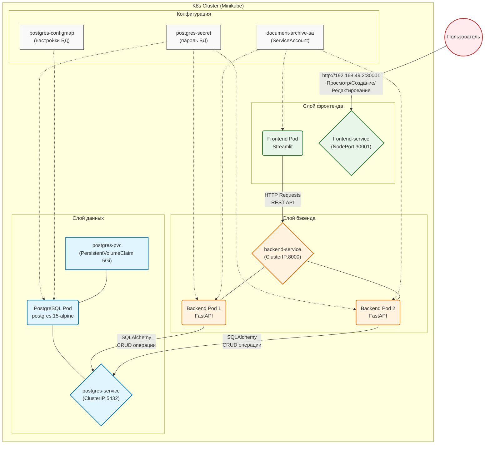

# Лабораторная работа 4.1. Создание и развертывание полнофункционального приложения

# Цель работы

Применить полученные знания по созданию и развертыванию трехзвенного приложения (Frontend + Backend + Database) в кластере Kubernetes. Научиться организовывать взаимодействие между микросервисами.

# Индивидуальное задание

| Вариант | Название системы | Бизнес-задача | Данные (Пример) |
|---------|------------------|---------------|-----------------|
| 12 | Rocket Launch Analytics | Мониторинг и анализ космических запусков | Название миссии, статус запуска, дата старта, провайдер, изображения ракет |

# Технический стек и окружение

| Компонент | Технология | Версия |
|-----------|------------|--------|
| **Операционная система** | Ubuntu | 22.04 LTS |
| **Контейнеризация** | Docker | |
| **Оркестрация** | Minikube (Driver: Docker), Kubernetes | |
| **База данных** | PostgreSQL | 15-alpine |
| **Язык программирования** | Python | 3.11 |
| **Backend** | FastAPI, Uvicorn | 0.104.1 |
| **Frontend** | Streamlit | 1.28.1 |
| **Библиотеки** | SQLAlchemy, psycopg2-binary, Pydantic, requests, pandas, plotly | |

# Архитектура решения



# Таблица пояснения компонентов архитектуры

| Блок | Компонент | Краткое пояснение |
|------|-----------|-------------------|
| **Configs** | Secret / ConfigMap / ServiceAccount | Secret хранит пароль PostgreSQL. ConfigMap содержит настройки базы данных (имя БД, пользователь). ServiceAccount предоставляет права доступа для подов бэкенда и фронтенда в кластере. |
| **DataLayer** | PostgreSQL / PVC | База данных для хранения документов, метаданных, истории изменений и файлов (BLOB). PVC 5Gi обеспечивает сохранность данных при перезапуске. |
| **BackendLayer** | FastAPI (2 реплики) | REST API сервис, реализующий CRUD операции, управление версиями, историю изменений, загрузку/скачивание файлов. Две реплики обеспечивают отказоустойчивость. |
| **FrontendLayer** | Streamlit | Пользовательский интерфейс для просмотра, создания, редактирования, удаления документов, просмотра статистики и журнала действий. Доступен через NodePort 30001. |
| **User** | Пользователь | Сотрудник организации, работающий с документами через веб-интерфейс (просмотр, создание, редактирование, удаление). |

# Структура проекта

# Исходные коды

## backend/Dockerfile

Сборка Docker образа бэкенда (Python 3.11, установка зависимостей, запуск uvicorn)

```
FROM python:3.12-slim

WORKDIR /app
COPY requirements.txt .
RUN pip install --no-cache-dir -r requirements.txt

COPY main.py .

CMD ["uvicorn", "main:app", "--host", "0.0.0.0", "--port", "8000"]
```

## backend/main.py

Основной файл приложения FastAPI: реализация всех CRUD операций, загрузка/скачивание файлов, история версий, статистика

```
import os
import uuid
from datetime import datetime
from typing import List, Optional
 
from fastapi import FastAPI, Depends, HTTPException, UploadFile, File, Form, status
from fastapi.responses import FileResponse
from sqlalchemy import create_engine, Column, Integer, String, Boolean, DateTime, ForeignKey, Text, func
from sqlalchemy.ext.declarative import declarative_base
from sqlalchemy.orm import sessionmaker, Session, relationship
from pydantic import BaseModel
 
app = FastAPI(title="Document Archive API")
 
# ========================= DATABASE CONFIG =========================
POSTGRES_USER = os.getenv("POSTGRES_USER", "postgres")
POSTGRES_PASSWORD = os.getenv("POSTGRES_PASSWORD", "password123")
POSTGRES_HOST = "postgres"
POSTGRES_DB = os.getenv("POSTGRES_DB", "documents_db")
 
DATABASE_URL = f"postgresql+psycopg2://{POSTGRES_USER}:{POSTGRES_PASSWORD}@{POSTGRES_HOST}:5432/{POSTGRES_DB}"
 
engine = create_engine(DATABASE_URL)
SessionLocal = sessionmaker(autocommit=False, autoflush=False, bind=engine)
Base = declarative_base()
 
UPLOAD_DIR = "/app/uploads"
os.makedirs(UPLOAD_DIR, exist_ok=True)
 
# ========================= MODELS =========================
class Document(Base):
    __tablename__ = "documents"
    
    id = Column(Integer, primary_key=True, index=True)
    name = Column(String, index=True, nullable=False)
    doc_type = Column(String, nullable=False)
    tag = Column(String, nullable=False)
    is_favorite = Column(Boolean, default=False)
    responsible = Column(String, default="Не указан")
    file_path = Column(String, nullable=True)
    original_filename = Column(String, nullable=True)
    created_at = Column(DateTime, default=datetime.utcnow)
    updated_at = Column(DateTime, default=datetime.utcnow, onupdate=datetime.utcnow)
 
class ActionLog(Base):
    __tablename__ = "action_logs"
    
    id = Column(Integer, primary_key=True, index=True)
    timestamp = Column(DateTime, default=datetime.utcnow)
    action = Column(String, nullable=False)
    document_id = Column(Integer, ForeignKey("documents.id", ondelete="CASCADE"), nullable=True)
    document_name = Column(String, nullable=False)
    details = Column(Text, nullable=True)
 
# Создаём таблицы
Base.metadata.create_all(bind=engine)
 
# ========================= DEPENDENCIES =========================
def get_db():
    db = SessionLocal()
    try:
        yield db
    finally:
        db.close()
 
def log_action(db: Session, action: str, doc_id: Optional[int], doc_name: str, details: str = ""):
    log = ActionLog(
        action=action,
        document_id=doc_id,
        document_name=doc_name,
        details=details
    )
    db.add(log)
    db.commit()
 
# ========================= SCHEMAS =========================
class DocumentBase(BaseModel):
    name: str
    doc_type: str
    tag: str
    is_favorite: bool = False
    responsible: str = "Не указан"
 
class DocumentCreate(DocumentBase):
    pass
 
class DocumentRead(DocumentBase):
    id: int
    created_at: datetime
    updated_at: datetime
    file_path: Optional[str] = None
    original_filename: Optional[str] = None
 
    model_config = {"from_attributes": True}
 
# ========================= API ENDPOINTS =========================
@app.post("/documents/create", response_model=DocumentRead)
def create_document(doc: DocumentCreate, db: Session = Depends(get_db)):
    db_doc = Document(**doc.model_dump())
    db.add(db_doc)
    db.commit()
    db.refresh(db_doc)
    
    log_action(db, "create", db_doc.id, db_doc.name, "Создан документ")
    return db_doc
 
@app.post("/documents/upload", response_model=DocumentRead)
async def upload_document(
    name: str = Form(...),
    doc_type: str = Form(...),
    tag: str = Form(...),
    is_favorite: bool = Form(False),
    responsible: str = Form("Не указан"),
    file: UploadFile = File(...),
    db: Session = Depends(get_db)
):
    # Сохраняем файл
    file_ext = file.filename.split(".")[-1] if "." in file.filename else "bin"
    unique_name = f"{uuid.uuid4()}.{file_ext}"
    file_path = os.path.join(UPLOAD_DIR, unique_name)
    
    with open(file_path, "wb") as f:
        f.write(await file.read())
    
    # Создаём запись в БД
    db_doc = Document(
        name=name,
        doc_type=doc_type,
        tag=tag,
        is_favorite=is_favorite,
        responsible=responsible,
        file_path=file_path,
        original_filename=file.filename
    )
    db.add(db_doc)
    db.commit()
    db.refresh(db_doc)
    
    log_action(db, "upload", db_doc.id, db_doc.name, f"Загружен файл: {file.filename}")
    return db_doc
 
@app.get("/documents", response_model=List[DocumentRead])
def get_all_documents(db: Session = Depends(get_db)):
    return db.query(Document).all()
 
@app.get("/documents/{doc_id}", response_model=DocumentRead)
def get_document(doc_id: int, db: Session = Depends(get_db)):
    doc = db.query(Document).filter(Document.id == doc_id).first()
    if not doc:
        raise HTTPException(status_code=404, detail="Документ не найден")
    return doc
 
@app.put("/documents/{doc_id}", response_model=DocumentRead)
def update_document(doc_id: int, doc: DocumentCreate, db: Session = Depends(get_db)):
    db_doc = db.query(Document).filter(Document.id == doc_id).first()
    if not db_doc:
        raise HTTPException(status_code=404, detail="Документ не найден")
    
    for key, value in doc.model_dump().items():
        setattr(db_doc, key, value)
    
    db.commit()
    db.refresh(db_doc)
    
    log_action(db, "update", db_doc.id, db_doc.name, "Метаданные документа обновлены")
    return db_doc
 
@app.delete("/documents/{doc_id}")
def delete_document(doc_id: int, db: Session = Depends(get_db)):
    try:
        doc = db.query(Document).filter(Document.id == doc_id).first()
        if not doc:
            raise HTTPException(status_code=404, detail="Документ не найден")
        
        doc_name = doc.name
        
        # Удаляем файл с диска, если он есть
        if doc.file_path:
            try:
                if os.path.exists(doc.file_path):
                    os.remove(doc.file_path)
            except Exception as e:
                print(f"Warning: Не удалось удалить файл {doc.file_path}: {e}")
        
        # Сначала удаляем связанные логи
        db.query(ActionLog).filter(ActionLog.document_id == doc_id).delete()
        
        # Теперь удаляем документ
        db.delete(doc)
        db.commit()
        
        return {"message": f"Документ «{doc_name}» успешно удалён"}
        
    except HTTPException:
        raise
    except Exception as e:
        db.rollback()
        print(f"Error deleting document {doc_id}: {e}")
        raise HTTPException(status_code=500, detail=f"Ошибка удаления: {str(e)}")
 
@app.get("/documents/{doc_id}/download")
def download_file(doc_id: int, db: Session = Depends(get_db)):
    doc = db.query(Document).filter(Document.id == doc_id).first()
    if not doc or not doc.file_path:
        raise HTTPException(status_code=404, detail="Файл не найден")
    
    if not os.path.exists(doc.file_path):
        raise HTTPException(status_code=404, detail="Файл отсутствует на сервере")
    
    log_action(db, "download", doc_id, doc.name, f"Скачан файл: {doc.original_filename}")
    
    return FileResponse(
        path=doc.file_path,
        filename=doc.original_filename or "document",
        media_type="application/octet-stream"
    )
 
@app.get("/stats")
def get_stats(db: Session = Depends(get_db)):
    total = db.query(Document).count()
    favorites = db.query(Document).filter(Document.is_favorite == True).count()
    
    by_type = {}
    for row in db.query(Document.doc_type, func.count(Document.id)).group_by(Document.doc_type).all():
        by_type[row[0]] = row[1]
    
    return {
        "total_documents": total,
        "favorites": favorites,
        "by_type": by_type
    }
 
@app.get("/logs")
def get_logs(db: Session = Depends(get_db)):
    logs = db.query(ActionLog).order_by(ActionLog.timestamp.desc()).all()
    return [
        {
            "timestamp": log.timestamp.isoformat(),
            "action": log.action,
            "document_name": log.document_name,
            "details": log.details or ""
        }
        for log in logs
    ]
 
@app.get("/")
def root():
    return {"message": "Document Archive API is running 🚀"}
```

## backend/requirements.txt

Список Python зависимостей: fastapi, uvicorn, sqlalchemy, psycopg2-binary, pydantic, python-multipart

```
fastapi==0.115.0
uvicorn[standard]==0.32.0
sqlalchemy==2.0.36
psycopg2-binary==2.9.10
pydantic==2.9.2
python-multipart==0.0.9
```

## frontend/Dockerfile

Сборка Docker образа фронтенда (Python 3.11, установка зависимостей, запуск streamlit)

```
FROM python:3.12-slim

WORKDIR /app
COPY requirements.txt .
RUN pip install --no-cache-dir -r requirements.txt

COPY app.py .

CMD ["streamlit", "run", "app.py", "--server.port=8501", "--server.address=0.0.0.0"]
```

## backend/app.py

Основное Streamlit приложение: пользовательский интерфейс со списком документов, созданием, редактированием, удалением, статистикой и журналом действий

```
import streamlit as st
import requests
import pandas as pd
import plotly.express as px
from datetime import datetime, timedelta
import json
 
API_URL = "http://backend:8000"
 
# Настройка страницы
st.set_page_config(
    page_title="Электронный архив документов",
    page_icon="📁",
    layout="wide",
    initial_sidebar_state="expanded"
)
 
# CSS для красивого оформления
st.markdown("""
<style>
    .main-header {
        background: linear-gradient(135deg, #667eea 0%, #764ba2 100%);
        padding: 2rem;
        border-radius: 1rem;
        color: white;
        margin-bottom: 2rem;
        text-align: center;
    }
    .stat-card {
        background: linear-gradient(135deg, #667eea 0%, #764ba2 100%);
        padding: 1.5rem;
        border-radius: 1rem;
        text-align: center;
        color: white;
        box-shadow: 0 4px 6px rgba(0,0,0,0.1);
    }
    .document-card {
        background: white;
        padding: 1rem;
        border-radius: 0.5rem;
        border-left: 4px solid #667eea;
        margin-bottom: 0.5rem;
        box-shadow: 0 2px 4px rgba(0,0,0,0.05);
        cursor: pointer;
        transition: all 0.3s;
    }
    .document-card:hover {
        transform: translateX(5px);
        box-shadow: 0 4px 8px rgba(0,0,0,0.1);
    }
    .history-item {
        padding: 0.75rem;
        border-left: 3px solid #667eea;
        margin-bottom: 0.5rem;
        background: #f8f9fa;
        border-radius: 0.25rem;
    }
    .activity-item {
        padding: 0.75rem;
        border-bottom: 1px solid #e0e0e0;
        margin-bottom: 0.5rem;
    }
    .badge {
        display: inline-block;
        padding: 0.25rem 0.5rem;
        border-radius: 0.25rem;
        font-size: 0.75rem;
        font-weight: bold;
    }
    .badge-active { background: #d4edda; color: #155724; }
    .badge-draft { background: #fff3cd; color: #856404; }
    .badge-archived { background: #e2e3e5; color: #383d41; }
    .stButton>button {
        width: 100%;
        border-radius: 0.5rem;
    }
</style>
""", unsafe_allow_html=True)
 
# Инициализация session state
if 'selected_document' not in st.session_state:
    st.session_state.selected_document = None
if 'view' not in st.session_state:
    st.session_state.view = "list"
if 'show_history' not in st.session_state:
    st.session_state.show_history = False
if 'create_mode' not in st.session_state:
    st.session_state.create_mode = None
 
# Маппинг для русских названий
TYPE_NAMES_RU = {
    "contract": "Договор",
    "invoice": "Счет", 
    "report": "Отчет",
    "policy": "Положение",
    "act": "Акт",
    "order": "Приказ",
    "other": "Прочее"
}
 
STATUS_NAMES_RU = {
    "draft": "Черновик",
    "active": "Действующий",
    "archived": "В архиве",
    "deleted": "Удален"
}
 
TYPE_NAMES_EN = {v: k for k, v in TYPE_NAMES_RU.items()}
STATUS_NAMES_EN = {v: k for k, v in STATUS_NAMES_RU.items()}
 
# Заголовок
st.markdown("""
<div class="main-header">
    <h1>📁 Электронный архив документов</h1>
    <p>Система управления документами с историей версий</p>
</div>
""", unsafe_allow_html=True)
 
# Боковая панель
with st.sidebar:
    st.image("https://img.icons8.com/color/96/000000/folder-invoices.png", width=80)
    st.markdown("### 📋 Навигация")
    
    menu = {
        "list": "📄 Список документов",
        "create": "➕ Создать документ",
        "stats": "📊 Статистика",
        "activity": "🕒 Журнал действий"
    }
    
    selected_menu = st.radio("", list(menu.values()))
    st.session_state.view = [k for k, v in menu.items() if v == selected_menu][0]
    
    st.markdown("---")
    
    # Фильтры для списка документов
    if st.session_state.view == "list":
        st.markdown("### 🔍 Фильтры")
        search_term = st.text_input("Поиск", placeholder="Название, описание...")
        
        col1, col2 = st.columns(2)
        with col1:
            doc_type_ru = st.selectbox("Тип", ["Все"] + list(TYPE_NAMES_RU.values()))
            doc_type = TYPE_NAMES_EN.get(doc_type_ru) if doc_type_ru != "Все" else None
        with col2:
            status_ru = st.selectbox("Статус", ["Все"] + list(STATUS_NAMES_RU.values()))
            status = STATUS_NAMES_EN.get(status_ru) if status_ru != "Все" else None
        
        favorite_only = st.checkbox("⭐ Только избранные")
        
        st.markdown("---")
        
        # Быстрая статистика
        try:
            stats_response = requests.get(f"{API_URL}/stats/")
            if stats_response.status_code == 200:
                stats = stats_response.json()
                st.metric("📄 Всего", stats['total_documents'])
                st.metric("💾 Размер", f"{stats['total_size_mb']:.1f} MB")
        except:
            pass
 
# Основной контент
# ============================================
 
# 1. СПИСОК ДОКУМЕНТОВ
# ============================================
if st.session_state.view == "list":
    st.markdown("### 📄 Список документов")
    
    params = {"skip": 0, "limit": 100}
    if search_term:
        params["search"] = search_term
    if doc_type:
        params["doc_type"] = doc_type
    if status:
        params["status"] = status
    if favorite_only:
        params["favorite_only"] = True
    
    try:
        response = requests.get(f"{API_URL}/documents/", params=params)
        if response.status_code == 200:
            documents = response.json()
            
            if documents:
                # Отображаем карточки документов
                for doc in documents:
                    with st.container():
                        col1, col2, col3, col4, col5 = st.columns([3, 1, 0.8, 0.8, 0.8])
                        
                        with col1:
                            status_class = "active" if doc['status'] == "active" else "draft" if doc['status'] == "draft" else "archived"
                            st.markdown(f"""
                            <div class="document-card">
                                <b>📄 {doc['title']}</b><br>
                                <small>📁 {TYPE_NAMES_RU.get(doc['document_type'], doc['document_type'])} | 
                                🔖 <span class="badge badge-{status_class}">{STATUS_NAMES_RU.get(doc['status'], doc['status'])}</span> | 
                                📅 {doc['created_at'][:10]}</small>
                                {'<br><small>⭐ Избранное</small>' if doc['is_favorite'] else ''}
                            </div>
                            """, unsafe_allow_html=True)
                        
                        with col2:
                            if st.button("👁️", key=f"view_{doc['id']}", help="Просмотр"):
                                st.session_state.selected_document = doc['id']
                                st.session_state.show_history = False
                                st.rerun()
                        
                        with col3:
                            if st.button("✏️", key=f"edit_{doc['id']}", help="Редактировать"):
                                st.session_state.selected_document = doc['id']
                                st.session_state.view = "create"
                                st.session_state.create_mode = "edit"
                                st.rerun()
                        
                        with col4:
                            if st.button("📜", key=f"history_{doc['id']}", help="История"):
                                st.session_state.selected_document = doc['id']
                                st.session_state.show_history = True
                                st.rerun()
                        
                        with col5:
                            if st.button("🗑️", key=f"delete_{doc['id']}", help="Удалить"):
                                if st.warning(f"Удалить документ {doc['title']}?"):
                                    del_response = requests.delete(f"{API_URL}/documents/{doc['id']}")
                                    if del_response.status_code == 200:
                                        st.success("Документ удален")
                                        st.rerun()
                
                # Модальное окно просмотра документа
                if st.session_state.selected_document and not st.session_state.show_history:
                    doc = next((d for d in documents if d['id'] == st.session_state.selected_document), None)
                    if doc:
                        st.markdown("---")
                        st.markdown("### 📄 Детали документа")
                        
                        col1, col2 = st.columns(2)
                        with col1:
                            st.write("**Название:**", doc['title'])
                            st.write("**Файл:**", doc['filename'])
                            st.write("**Тип:**", TYPE_NAMES_RU.get(doc['document_type'], doc['document_type']))
                            st.write("**Статус:**", STATUS_NAMES_RU.get(doc['status'], doc['status']))
                            st.write("**Версия:**", doc['version'])
                        with col2:
                            st.write("**Создан:**", doc['created_at'][:19])
                            st.write("**Обновлен:**", doc['updated_at'][:19] if doc['updated_at'] else "—")
                            st.write("**Размер:**", f"{doc['file_size'] / 1024:.2f} KB" if doc['file_size'] > 0 else "—")
                            st.write("**Теги:**", doc['tags'] or "—")
                            st.write("**Описание:**", doc['description'] or "—")
                        
                        if st.button("Закрыть", key="close_view"):
                            st.session_state.selected_document = None
                            st.rerun()
                
                # История документа
                if st.session_state.selected_document and st.session_state.show_history:
                    st.markdown("---")
                    st.markdown("### 📜 История изменений")
                    
                    history_response = requests.get(f"{API_URL}/documents/{st.session_state.selected_document}/history")
                    if history_response.status_code == 200:
                        history = history_response.json()
                        if history:
                            for h in history:
                                action_icon = {
                                    "create": "➕ Создание",
                                    "update": "✏️ Изменение",
                                    "delete": "🗑️ Удаление"
                                }.get(h['action'], h['action'])
                                
                                st.markdown(f"""
                                <div class="history-item">
                                    <b>{action_icon}</b>
                                    <span style="float: right;">🕒 {h['changed_at'][:19]}</span><br>
                                    <small>👤 {h['changed_by']}</small>
                                    <br><small>📝 {h['new_value']}</small>
                                </div>
                                """, unsafe_allow_html=True)
                        else:
                            st.info("История изменений пуста")
                    
                    if st.button("Закрыть историю"):
                        st.session_state.selected_document = None
                        st.session_state.show_history = False
                        st.rerun()
            else:
                st.info("📭 Документы не найдены")
        else:
            st.error("❌ Не удалось загрузить документы")
    except Exception as e:
        st.error(f"❌ Ошибка: {e}")
 
# 2. СОЗДАНИЕ/РЕДАКТИРОВАНИЕ ДОКУМЕНТА
# ============================================
elif st.session_state.view == "create":
    if st.session_state.create_mode == "edit":
        st.markdown("### ✏️ Редактирование документа")
        
        # Загружаем документ для редактирования
        try:
            response = requests.get(f"{API_URL}/documents/{st.session_state.selected_document}")
            if response.status_code == 200:
                doc = response.json()
                
                with st.form("edit_form"):
                    col1, col2 = st.columns(2)
                    
                    with col1:
                        title = st.text_input("Название *", value=doc['title'])
                        filename = st.text_input("Имя файла *", value=doc['filename'])
                        doc_type_ru = st.selectbox("Тип", list(TYPE_NAMES_RU.values()), 
                                                   index=list(TYPE_NAMES_RU.values()).index(TYPE_NAMES_RU.get(doc['document_type'], "Прочее")))
                    
                    with col2:
                        status_ru = st.selectbox("Статус", list(STATUS_NAMES_RU.values()),
                                                index=list(STATUS_NAMES_RU.values()).index(STATUS_NAMES_RU.get(doc['status'], "Черновик")))
                        tags = st.text_input("Теги", value=doc['tags'] or "")
                        is_favorite = st.checkbox("⭐ В избранное", value=doc['is_favorite'])
                    
                    description = st.text_area("Описание", value=doc['description'] or "")
                    uploaded_file = st.file_uploader("📎 Загрузить новый файл (оставьте пустым, чтобы не менять)", 
                                                     type=['pdf', 'docx', 'txt', 'jpg', 'png', 'xlsx'])
                    
                    col1, col2 = st.columns(2)
                    with col1:
                        submitted = st.form_submit_button("💾 Сохранить изменения")
                    with col2:
                        cancelled = st.form_submit_button("❌ Отмена")
                    
                    if submitted:
                        data = {
                            "title": title,
                            "filename": filename,
                            "document_type": TYPE_NAMES_EN[doc_type_ru],
                            "status": STATUS_NAMES_EN[status_ru],
                            "tags": tags,
                            "description": description,
                            "is_favorite": str(is_favorite).lower()
                        }
                        
                        files = None
                        if uploaded_file:
                            files = {"file": uploaded_file}
                        
                        try:
                            response = requests.put(f"{API_URL}/documents/{st.session_state.selected_document}", 
                                                   data=data, files=files)
                            if response.status_code == 200:
                                st.success("✅ Документ обновлен!")
                                st.session_state.view = "list"
                                st.session_state.create_mode = None
                                st.session_state.selected_document = None
                                st.rerun()
                            else:
                                st.error(f"❌ Ошибка: {response.text}")
                        except Exception as e:
                            st.error(f"❌ Ошибка: {e}")
                    
                    if cancelled:
                        st.session_state.view = "list"
                        st.session_state.create_mode = None
                        st.session_state.selected_document = None
                        st.rerun()
        except Exception as e:
            st.error(f"❌ Ошибка загрузки документа: {e}")
    
    else:
        st.markdown("### ➕ Создание нового документа")
        
        # Выбор способа создания
        col1, col2 = st.columns(2)
        with col1:
            if st.button("📝 Создать без файла", use_container_width=True):
                st.session_state.create_mode = "no_file"
        with col2:
            if st.button("📎 Создать с файлом", use_container_width=True):
                st.session_state.create_mode = "with_file"
        
        st.markdown("---")
        
        if st.session_state.create_mode == "no_file":
            st.info("📝 Создание документа без прикрепленного файла")
            with st.form("create_form_no_file"):
                col1, col2 = st.columns(2)
                
                with col1:
                    title = st.text_input("Название *")
                    filename = st.text_input("Имя файла *")
                
                with col2:
                    doc_type_ru = st.selectbox("Тип", list(TYPE_NAMES_RU.values()))
                    status_ru = st.selectbox("Статус", list(STATUS_NAMES_RU.values()))
                
                description = st.text_area("Описание")
                tags = st.text_input("Теги")
                is_favorite = st.checkbox("⭐ В избранное")
                
                col1, col2 = st.columns(2)
                with col1:
                    submitted = st.form_submit_button("✅ Создать")
                with col2:
                    cancelled = st.form_submit_button("❌ Отмена")
                
                if submitted:
                    if not title or not filename:
                        st.error("⚠️ Заполните название и имя файла")
                    else:
                        data = {
                            "title": title,
                            "filename": filename,
                            "document_type": TYPE_NAMES_EN[doc_type_ru],
                            "status": STATUS_NAMES_EN[status_ru],
                            "description": description,
                            "tags": tags,
                            "is_favorite": str(is_favorite).lower()
                        }
                        
                        try:
                            response = requests.post(f"{API_URL}/documents/", data=data)
                            if response.status_code == 200:
                                st.success("✅ Документ создан!")
                                st.balloons()
                                st.session_state.view = "list"
                                st.session_state.create_mode = None
                                st.rerun()
                            else:
                                st.error(f"❌ Ошибка: {response.text}")
                        except Exception as e:
                            st.error(f"❌ Ошибка: {e}")
                
                if cancelled:
                    st.session_state.create_mode = None
                    st.rerun()
        
        elif st.session_state.create_mode == "with_file":
            st.info("📎 Создание документа с прикрепленным файлом")
            with st.form("create_form_with_file"):
                col1, col2 = st.columns(2)
                
                with col1:
                    title = st.text_input("Название *")
                    filename = st.text_input("Имя файла *")
                
                with col2:
                    doc_type_ru = st.selectbox("Тип", list(TYPE_NAMES_RU.values()))
                    status_ru = st.selectbox("Статус", list(STATUS_NAMES_RU.values()))
                
                description = st.text_area("Описание")
                tags = st.text_input("Теги")
                is_favorite = st.checkbox("⭐ В избранное")
                uploaded_file = st.file_uploader("📎 Выберите файл", type=['pdf', 'docx', 'txt', 'jpg', 'png', 'xlsx'])
                
                col1, col2 = st.columns(2)
                with col1:
                    submitted = st.form_submit_button("✅ Создать")
                with col2:
                    cancelled = st.form_submit_button("❌ Отмена")
                
                if submitted:
                    if not title or not filename:
                        st.error("⚠️ Заполните название и имя файла")
                    elif not uploaded_file:
                        st.error("⚠️ Выберите файл для загрузки")
                    else:
                        data = {
                            "title": title,
                            "filename": filename,
                            "document_type": TYPE_NAMES_EN[doc_type_ru],
                            "status": STATUS_NAMES_EN[status_ru],
                            "description": description,
                            "tags": tags,
                            "is_favorite": str(is_favorite).lower()
                        }
                        files = {"file": uploaded_file}
                        
                        try:
                            response = requests.post(f"{API_URL}/documents/", data=data, files=files)
                            if response.status_code == 200:
                                st.success("✅ Документ создан с файлом!")
                                st.balloons()
                                st.session_state.view = "list"
                                st.session_state.create_mode = None
                                st.rerun()
                            else:
                                st.error(f"❌ Ошибка: {response.text}")
                        except Exception as e:
                            st.error(f"❌ Ошибка: {e}")
                
                if cancelled:
                    st.session_state.create_mode = None
                    st.rerun()
 
# 3. СТАТИСТИКА
# ============================================
elif st.session_state.view == "stats":
    st.markdown("### 📊 Статистика и аналитика")
    
    try:
        response = requests.get(f"{API_URL}/stats/")
        if response.status_code == 200:
            stats = response.json()
            
            col1, col2, col3, col4 = st.columns(4)
            with col1:
                st.markdown(f"""
                <div class="stat-card">
                    <h2>📄</h2>
                    <h2>{stats['total_documents']}</h2>
                    <p>Всего документов</p>
                </div>
                """, unsafe_allow_html=True)
            
            with col2:
                st.markdown(f"""
                <div class="stat-card">
                    <h2>💾</h2>
                    <h2>{stats['total_size_mb']:.1f} MB</h2>
                    <p>Общий размер</p>
                </div>
                """, unsafe_allow_html=True)
            
            with col3:
                st.markdown(f"""
                <div class="stat-card">
                    <h2>🔢</h2>
                    <h2>{stats['avg_version']}</h2>
                    <p>Средняя версия</p>
                </div>
                """, unsafe_allow_html=True)
            
            with col4:
                    active_count = stats['by_status'].get('active', 0)
                    st.markdown(f"""
                    <div class="stat-card">
                        <h2>✅</h2>
                        <h2>{active_count}</h2>
                        <p>Действующих</p>
                    </div>
                    """, unsafe_allow_html=True)
            
            col1, col2 = st.columns(2)
            
            with col1:
                st.markdown("#### 📊 Распределение по типам")
                type_data = {TYPE_NAMES_RU.get(k, k): v for k, v in stats['by_type'].items() if v > 0}
                if type_data:
                    fig = px.pie(values=list(type_data.values()), names=list(type_data.keys()), 
                                title="Документы по типам",
                                color_discrete_sequence=px.colors.qualitative.Set3)
                    fig.update_layout(height=400)
                    st.plotly_chart(fig, use_container_width=True)
            
            with col2:
                st.markdown("#### 📊 Статусы документов")
                status_data = {STATUS_NAMES_RU.get(k, k): v for k, v in stats['by_status'].items() if v > 0 and k != 'deleted'}
                if status_data:
                    fig = px.bar(x=list(status_data.keys()), y=list(status_data.values()), 
                                title="Документы по статусам",
                                color=list(status_data.keys()),
                                color_discrete_sequence=px.colors.qualitative.Pastel)
                    fig.update_layout(height=400)
                    st.plotly_chart(fig, use_container_width=True)
            
            st.markdown("---")
            st.markdown("#### 📋 Детальная статистика")
            
            col1, col2 = st.columns(2)
            with col1:
                st.markdown("**По типам:**")
                for doc_type, count in stats['by_type'].items():
                    if count > 0:
                        st.write(f"- {TYPE_NAMES_RU.get(doc_type, doc_type)}: {count}")
            
            with col2:
                st.markdown("**По статусам:**")
                for status, count in stats['by_status'].items():
                    if count > 0 and status != 'deleted':
                        st.write(f"- {STATUS_NAMES_RU.get(status, status)}: {count}")
        else:
            st.error("❌ Не удалось загрузить статистику")
    except Exception as e:
        st.error(f"❌ Ошибка: {e}")
 
# 4. ЖУРНАЛ ДЕЙСТВИЙ
# ============================================
elif st.session_state.view == "activity":
    st.markdown("### 🕒 Журнал действий")
    
    try:
        response = requests.get(f"{API_URL}/stats/")
        if response.status_code == 200:
            stats = response.json()
            recent_activity = stats.get('recent_activity', [])
            
            if recent_activity:
                for activity in recent_activity:
                    action_icon = {
                        "create": "➕ Создание документа",
                        "update": "✏️ Редактирование",
                        "delete": "🗑️ Удаление"
                    }.get(activity['action'], "📌 Действие")
                    
                    time = datetime.fromisoformat(activity['changed_at']).strftime('%d.%m.%Y %H:%M:%S')
                    
                    st.markdown(f"""
                    <div class="activity-item">
                        <b>{action_icon}</b>
                        <span style="float: right;">🕒 {time}</span><br>
                        <small>Документ #{activity['document_id']}</small><br>
                        <small>👤 {activity['changed_by']}</small>
                    </div>
                    """, unsafe_allow_html=True)
            else:
                st.info("📭 Журнал действий пуст")
        else:
            st.error("❌ Не удалось загрузить журнал")
    except Exception as e:
        st.error(f"❌ Ошибка: {e}")
 
# Футер
st.markdown("---")
st.markdown("""
<div style="text-align: center; color: gray; padding: 1rem;">
    📁 Электронный архив документов | Система управления документами
</div>
""", unsafe_allow_html=True)
```

## frontend/requirements.txt

Список Python зависимостей: streamlit, requests, pandas, plotly

```
streamlit==1.39.0
requests==2.32.3
pandas==2.2.3
plotly==5.24.1
```

## Манифесты Kubernets

| Файл | Описание |
|------|----------|
| `k8s/namespace.yaml` | Создает пространство имен `document-archive` для изоляции всех ресурсов приложения |
| `k8s/serviceaccount.yaml` | Создает ServiceAccount `document-archive-sa`, Role и RoleBinding для управления доступом подов к Kubernetes API |
| `k8s/postgres-configmap.yaml` | Хранит переменные окружения для PostgreSQL: POSTGRES_DB, POSTGRES_USER |
| `k8s/postgres-secret.yaml` | Хранит пароль PostgreSQL в зашифрованном виде (base64) |
| `k8s/postgres-pvc.yaml` | PVC для сохранения данных PostgreSQL при перезапусках и сбоях |
| `k8s/postgres-deployment.yaml` | Развертывание PostgreSQL: порт 5432, подключение PVC, переменные окружения из ConfigMap и Secret |
| `k8s/postgres-service.yaml` | ClusterIP сервис для внутреннего доступа бэкенда к PostgreSQL (порт 5432) |
| `k8s/backend-deployment.yaml` | Развертывание бэкенда: 2 реплики FastAPI, порт 8000, переменная DATABASE_URL |
| `k8s/backend-service.yaml` | ClusterIP сервис для доступа фронтенда к бэкенду (порт 8000) |
| `k8s/frontend-deployment.yaml` | Развертывание фронтенда: Streamlit, порт 8501, переменная API_URL |
| `k8s/frontend-service.yaml` | NodePort сервис для внешнего доступа пользователей к приложению (порт 30001) |

# Запуск

Запускаем миникуб:


Переходим в окружение:


Собираем кастомный образ для бекэнда:


Собираем кастомный образ для фронтэнда:


Применяем манифесты Kubernets:


Запускаем приложение:


# Результат

Перейдем в браузер и посмотрим на приложение.

Приложение имеет 4 раздела. Первый раздел содержит список документов, созданных в приложении:


На этой странице доступен поиск по наименованию, фильтрация по типу документа, сортировка по нескольким параметрам и возможность отображать только избранные документы.

Также здесь можно просмотреть содержимое документа и отредактировать его:


Тут же документ можно удалить, если он больше не актуален.

Второй раздел - создание документов:


Необходимо заполнить все поля и также можно прикрепить файл, который служит приложением к документу.

В разделе "Статистика" можно посмотреть дашборд:


В разделе журнал действий можно просмотреть историю взаимодействия с файлами и при необходимости выгрузить в csv файл:


