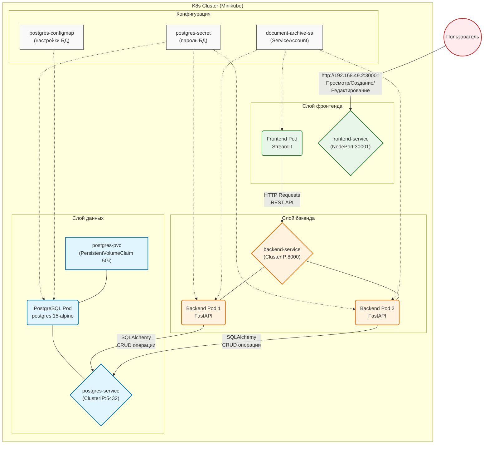

# Лабораторная работа 4.1. Создание и развертывание полнофункционального приложения

# Цель работы

Применить полученные знания по созданию и развертыванию трехзвенного приложения (Frontend + Backend + Database) в кластере Kubernetes. Научиться организовывать взаимодействие между микросервисами.

# Индивидуальное задание

| Вариант | Название системы | Бизнес-задача | Данные (Пример) |
|---------|------------------|---------------|-----------------|
| 12 | Rocket Launch Analytics | Мониторинг и анализ космических запусков | Название миссии, статус запуска, дата старта, провайдер, изображения ракет |

# Технический стек и окружение

| Компонент | Технология | Версия |
|-----------|------------|--------|
| **Операционная система** | Ubuntu | 22.04 LTS |
| **Контейнеризация** | Docker | |
| **Оркестрация** | Minikube (Driver: Docker), Kubernetes | |
| **База данных** | PostgreSQL | 15-alpine |
| **Язык программирования** | Python | 3.11 |
| **Backend** | FastAPI, Uvicorn | 0.104.1 |
| **Frontend** | Streamlit | 1.28.1 |
| **Библиотеки** | SQLAlchemy, psycopg2-binary, Pydantic, requests, pandas, plotly | |

# Архитектура решения

# Таблица пояснения компонентов архитектуры

| Блок | Компонент | Краткое пояснение |
|------|-----------|-------------------|
| **Configs** | Secret / ConfigMap / ServiceAccount | Secret хранит пароль PostgreSQL. ConfigMap содержит настройки базы данных (имя БД, пользователь). ServiceAccount предоставляет права доступа для подов бэкенда и фронтенда в кластере. |
| **DataLayer** | PostgreSQL / PVC | База данных для хранения документов, метаданных, истории изменений и файлов (BLOB). PVC 5Gi обеспечивает сохранность данных при перезапуске. |
| **BackendLayer** | FastAPI (2 реплики) | REST API сервис, реализующий CRUD операции, управление версиями, историю изменений, загрузку/скачивание файлов. Две реплики обеспечивают отказоустойчивость. |
| **FrontendLayer** | Streamlit | Пользовательский интерфейс для просмотра, создания, редактирования, удаления документов, просмотра статистики и журнала действий. Доступен через NodePort 30001. |
| **User** | Пользователь | Сотрудник организации, работающий с документами через веб-интерфейс (просмотр, создание, редактирование, удаление). |
